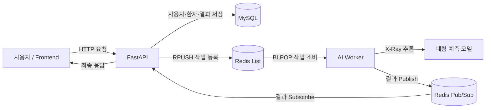

# 흉부 X-Ray 이미지 기반의 폐렴 판독 모델을 활용한 '폐렴 환자 관리 백오피스' 구축 프로젝트

FastAPI 기반의 환자·진료기록 관리 기능과 폐렴 예측 AI를 하나의 웹 서비스로 연결한 팀 프로젝트입니다.

기능 개발뿐 아니라 요구사항 정의, API 설계, 협업 규칙, 브랜치 전략, 계층형 구조, Redis 작업 큐, Docker 기반 실행 환경까지 단계적으로 구성했습니다.

## 프로젝트 구성

- **Backend**: FastAPI, SQLAlchemy, Alembic
- **Database**: MySQL
- **Message Broker**: Redis List + Pub/Sub
- **AI Worker**: 폐렴 예측 모델을 실행하는 별도 Python 프로세스
- **Frontend**: 정적 HTML·JavaScript와 FastAPI API 연동
- **Package Manager**: `uv`
- **Infrastructure**: Docker, Docker Compose

## 전체 진행 과정

| 단계 | 목표 | 주요 산출물 및 확인 내용 |
|---|---|---|
| 1 | Team Rule 정의 | `docs/1일차_team_rules.md` |
| 2 | 사용자 요구사항 정의 | 사용자·환자·진료기록·폐렴 예측 요구사항 |
| 3 | API 명세서 작성 | `docs/4일차_USER_API_설계.md`, `docs/5일차_환자관리_API_설계.md`, `docs/6일차_폐렴예측_API_설계.md` |
| 4 | Git & GitHub Branch 전략 구성 | `docs/2일차_git_branch_전략.md`, 기능 브랜치 → PR → 리뷰 → 병합 |
| 5 | 프로젝트 세팅 | FastAPI 계층 구조, SQLAlchemy 모델, Alembic, 환경변수, 정적 프론트엔드 |
| 6 | API 및 AI Worker 구현·병합 | 인증·사용자·환자·진료기록 API, Redis 기반 AI Worker |
| 7 | 아키텍처 설계 및 적용 | FastAPI·Redis·AI Worker·MySQL 책임 분리 |
| 8 | Docker 인프라 작성 | FastAPI/MySQL/Redis/AI Worker 컨테이너와 영속 볼륨 |

---

## 1. Team Rule 정의

프로젝트 시작 시 협업 속도보다 **예측 가능한 소통과 안전한 통합**을 우선하는 규칙을 정했습니다.

### 협업 규칙

- 수업 후 최소 30분의 코어 타임을 확보해 진행 상황을 함께 확인합니다.
- 각자 맡은 작업은 개인 브랜치에서 진행하고 하루에 한 번 이상 의미 있는 단위로 커밋합니다.
- 작업 시작 전 할 일을, 종료 후 완료 내용과 막힌 부분을 팀 채널에 공유합니다.
- 30분 이상 혼자 해결하지 못한 문제는 팀에 공유합니다.
- 작업마다 주 담당자와 검토 담당자를 정합니다.
- 일정 지연이나 부재가 예상되면 현재 상태, 남은 일, 문제점, 지원이 필요한 부분을 즉시 알립니다.

### 코드 협업 규칙

- `main`, `develop`에서 직접 작업하지 않습니다.
- `app/main.py`, `app/core/`, `app/models/`, 공통 스키마, `docker-compose.yml`, `pyproject.toml`처럼 영향 범위가 큰 파일은 수정 전에 공유합니다.
- PR은 최소 한 명 이상의 팀원이 검토한 뒤 병합합니다.
- 로컬 실행, Swagger 확인, 주요 정상·예외 요청 테스트, 충돌 해결을 병합 조건으로 삼습니다.
- 리뷰는 작성자가 아닌 코드의 동작·요구사항·보안·유지보수성을 대상으로 합니다.
- `.env`, 비밀번호, JWT Secret, API Key, 실제 환자 정보와 X-Ray 이미지는 커밋하지 않습니다.

커밋 메시지는 `feat`, `fix`, `docs`, `test`, `refactor`, `chore` 등 작업 목적이 드러나는 접두사를 사용했습니다.

```text
feat: 환자 목록 조회 API 추가
docs: API 명세서 작성
fix: 로그인 토큰 오류 수정
```

## 2. 사용자 요구사항 정의

사용자 관점의 기능을 먼저 정리한 뒤 API와 데이터 모델로 구체화했습니다.

### 계정과 권한

- 사용자는 회원가입·로그인·토큰 갱신·로그아웃을 할 수 있어야 합니다.
- 인증된 사용자는 자신의 정보를 조회하거나 수정할 수 있어야 합니다.
- 관리자와 의료진 등 역할에 따라 접근 가능한 기능을 제한해야 합니다.
- 비밀번호와 토큰 등 민감정보는 API 응답이나 로그에 노출하지 않아야 합니다.

### 환자와 진료기록

- 권한이 있는 사용자는 환자를 등록·조회·수정할 수 있어야 합니다.
- 환자별 진료기록과 X-Ray 이미지를 등록하고 조회할 수 있어야 합니다.
- X-Ray는 JPEG 또는 PNG만 허용하며, 업로드 크기와 접근 권한을 검증해야 합니다.
- 파일 저장 실패와 DB 저장 실패가 서로 불일치하지 않도록 정리·롤백해야 합니다.

### 폐렴 예측

- 진료기록에 연결된 X-Ray를 폐렴 예측 모델로 분석할 수 있어야 합니다.
- 동일한 진료기록과 모델의 기존 결과가 있으면 재사용해야 합니다.
- 여러 요청이 동시에 들어와도 일반 API가 AI 연산 때문에 장시간 점유되지 않아야 합니다.
- 모델 오류, 잘못된 이미지, Worker 응답 지연을 구분된 오류로 반환해야 합니다.

### 웹 화면

- 정적 프론트엔드에서 인증, 사용자, 환자, 진료기록, 예측 API를 실제로 호출해야 합니다.
- 성공 화면뿐 아니라 인증 실패, 잘못된 입력, 서버 오류도 사용자가 확인할 수 있어야 합니다.

## 3. API 명세서 작성

구현 전에 팀원이 같은 계약을 기준으로 작업하도록 다음 항목을 문서화했습니다.

- HTTP Method와 Endpoint
- Path·Query Parameter
- Request Body와 자료형
- Response Body와 상태 코드
- 인증·인가 조건
- 정상 흐름과 주요 예외 흐름

API는 역할별로 분리했습니다.

| 영역 | 책임 | 관련 구현 |
|---|---|---|
| Auth | 로그인, 토큰 발급·갱신, 로그아웃 | `app/apis/auth.py`, `app/services/auth_service.py` |
| User/Admin | 사용자 프로필과 관리자 기능 | `app/apis/users.py`, `app/apis/admin.py` |
| Patient | 환자 등록·조회·수정 | `app/apis/patients.py` |
| Medical Record | 진료기록과 X-Ray 등록 | `app/apis/medical_records.py` |
| Prediction | X-Ray 폐렴 예측 요청과 결과 반환 | FastAPI Producer + AI Worker |

명세 변경 시 문서만 고치는 것이 아니라 스키마, 서비스, 프론트엔드 호출 코드도 함께 갱신하는 것을 원칙으로 삼았습니다. 실제 통합 과정에서는 [PR #26](https://github.com/Autobot1236/Oz_codingSchool/pull/26)에서 인증·사용자 API의 기반을, [PR #41](https://github.com/Autobot1236/Oz_codingSchool/pull/41)에서 환자 수정과 X-Ray 진료기록 등록 기능을 확인했습니다.

폐렴 예측 영역은 [PR #43](https://github.com/Autobot1236/Oz_codingSchool/pull/43)에서 모델 입출력, 캐시, 권한, 오류와 성능 기준을 문서화한 뒤 [PR #46](https://github.com/Autobot1236/Oz_codingSchool/pull/46)에서 최종 API 계약을 구현했습니다.

```http
POST /api/v1/medical-records/{record_id}/ai-predictions
GET  /api/v1/medical-records/{record_id}/ai-predictions
```

- 신규 예측 결과: `cached=false`
- 기존 DB 결과 재사용: `cached=true`
- Confidence: `0~100` 백분율
- 목록 응답: `{ predictions, page, size, total }`

## 4. Git & GitHub Branch 전략 구성

초기 문서에서는 짧은 프로젝트에 적합한 GitHub Flow를 선택했습니다. 프로젝트가 커지면서 실제 운영은 안정 브랜치와 통합 브랜치를 나눈 **수정된 GitHub Flow**로 발전했습니다.

```text
main
  └─ develop
       ├─ feature/*
       ├─ fix/*
       ├─ docs/*
       └─ test/*
```

- `main`: 통합 실행과 리뷰가 끝난 안정 코드
- `develop`: 기능을 모아 통합 검증하는 브랜치
- `feature/*`: 기능 개발
- `fix/*`: 오류 수정
- `docs/*`: 문서 작업
- `test/*`: 테스트 작업

작업 흐름은 다음과 같습니다.

1. 최신 `main` 또는 `develop`을 가져옵니다.
2. 한 가지 목적을 가진 작업 브랜치를 만듭니다.
3. 작은 단위로 구현하고 커밋합니다.
4. 원격 브랜치에 Push하고 PR을 생성합니다.
5. 테스트 방법과 영향 범위를 PR에 기록합니다.
6. 팀 리뷰와 충돌 해결 후 `develop`에 병합합니다.
7. Stage 단위 통합 검증 후 `develop → main` PR로 반영합니다.

[PR #37](https://github.com/Autobot1236/Oz_codingSchool/pull/37)은 초기 기능·문서 47개 커밋을, [PR #42](https://github.com/Autobot1236/Oz_codingSchool/pull/42)는 AI 모델과 후속 기능을, 최종 [PR #61](https://github.com/Autobot1236/Oz_codingSchool/pull/61)은 Docker·Redis·AI Worker·테스트를 포함한 16개 커밋을 `main`에 통합한 이력을 보여줍니다.

반면 [PR #8](https://github.com/Autobot1236/Oz_codingSchool/pull/8), [PR #31](https://github.com/Autobot1236/Oz_codingSchool/pull/31)처럼 닫혔지만 병합되지 않은 PR도 있어, **PR 생성과 실제 반영을 구분해 추적해야 한다**는 점을 확인했습니다.

## 5. 프로젝트 세팅

Stage 1에서 템플릿 저장소를 기반으로 공개 저장소를 만들고 팀원을 Collaborator로 초대했습니다. 이후 Stage 3에서 폴더별 책임과 데이터 흐름을 분석하고 계층형 구조를 적용했습니다.

```text
app/
├── apis/           # HTTP 요청·응답과 라우팅
├── core/           # 설정, 보안, 의존성, DB·Redis 연결
├── models/         # SQLAlchemy 데이터 모델
├── repositories/   # 데이터 접근
├── schemas/        # 요청·응답 검증
├── services/       # 비즈니스 로직
└── main.py         # FastAPI 앱 진입점

worker/
├── main.py         # 큐 소비와 추론 실행
├── model.py        # 폐렴 예측 모델 로딩·추론
└── redis_client.py # Worker용 동기 Redis 연결

alembic/            # DB 마이그레이션
docs/               # 단계별 설계·회고 문서
static/             # HTML·JavaScript 프론트엔드
```

설정값은 환경변수로 분리하고 공유 가능한 키만 `.env.example`에 남겼습니다. SQLAlchemy 모델 변경은 Alembic revision으로 기록하여 팀원이 같은 DB 스키마를 재현할 수 있도록 했습니다.

## 6. API 및 AI Worker 코드 작성 후 병합

### API 구현

- [PR #26](https://github.com/Autobot1236/Oz_codingSchool/pull/26): JWT 설정, 인증 의존성, Refresh Token 모델, 인증·사용자 API와 서비스 구현
- [PR #37](https://github.com/Autobot1236/Oz_codingSchool/pull/37): 인증·관리자·사용자 API, Repository/Service 계층, 정적 화면, 테스트와 API 설계 문서를 `main`에 통합
- [PR #41](https://github.com/Autobot1236/Oz_codingSchool/pull/41): 환자 수정, X-Ray 진료기록 등록, JPEG/PNG·10 MiB 검증, 권한 검사, UUID 파일명, 실패 시 정리·롤백과 테스트 구현
- [PR #43](https://github.com/Autobot1236/Oz_codingSchool/pull/43): SimpleCNN 모델 계약, 캐시, 인증·권한, 오류, 동시 요청과 테스트 기준을 API 명세로 확정
- [PR #44](https://github.com/Autobot1236/Oz_codingSchool/pull/44): 예측 API 경로·캐시·목록 응답 계약을 정적 프론트에 반영
- [PR #45](https://github.com/Autobot1236/Oz_codingSchool/pull/45): AI 분석 결과 저장과 DB 캐시 구현
- [PR #46](https://github.com/Autobot1236/Oz_codingSchool/pull/46): 예측 실행·목록 조회 API와 Pydantic Schema 구현, 전체 테스트 64개 통과
- [PR #47](https://github.com/Autobot1236/Oz_codingSchool/pull/47): 손상된 X-Ray를 `422 invalid_xray_image`로 분리하고 프론트 응답 구조 보완
- [PR #49](https://github.com/Autobot1236/Oz_codingSchool/pull/49): 정적 프론트와 API 통합, Refresh Token migration, 반응형 UI와 E2E 화면 추가
- [PR #56](https://github.com/Autobot1236/Oz_codingSchool/pull/56): FastAPI의 직접 추론을 Redis 작업 등록·결과 구독 방식으로 전환, 전체 테스트 71개 통과

기능은 `API → Service → Repository → Model`의 경계를 유지했습니다. API 계층은 요청 검증과 상태 코드에 집중하고, 서비스 계층은 권한과 업무 규칙을, Repository는 데이터 접근을 담당하도록 분리했습니다.

### AI Worker 구현

[PR #42](https://github.com/Autobot1236/Oz_codingSchool/pull/42)에서 PyTorch CPU 기반 SimpleCNN 모델과 가중치를 통합하고, [PR #58](https://github.com/Autobot1236/Oz_codingSchool/pull/58)에서 Worker와 Redis 연결을 구현했습니다.

- Redis List의 `RPUSH`와 `BLPOP`을 이용한 FIFO 작업 큐
- 작업별 결과 채널 Publish
- 모델 사전 로딩
- 이미지 경로 이탈 방지 검증
- Payload와 confidence 값 검증
- `job_id` 기반 로그
- 가짜 Redis·모델을 이용한 Worker 테스트
- 한 작업당 결과를 한 번만 발행하는 처리

[PR #54](https://github.com/Autobot1236/Oz_codingSchool/pull/54)는 AI 의존성을 별도 `ai` extra로 분리하고 Worker 전용 Docker 이미지와 Compose 서비스를 추가했습니다. [PR #60](https://github.com/Autobot1236/Oz_codingSchool/pull/60)은 라이브 E2E 테스트에서 발견한 Redis `socket_timeout`과 `BLPOP` 타임아웃 충돌을 수정했습니다.

최종 E2E 검증에서는 MySQL·Redis·FastAPI·AI Worker를 함께 실행해 회원가입부터 X-Ray 등록, 예측, DB 저장, 캐시 재사용까지 확인했습니다. 해당 환경에서 첫 예측은 약 0.128초, 캐시 재호출은 약 0.025초였으며 이는 단일 개발 환경의 확인값이지 서비스 성능 보장값은 아닙니다.

자동 재시도는 1차 범위에서 제외했습니다. 재시도가 필요한 일시적 장애와 다시 실행해도 실패하는 입력 오류를 먼저 구분한 뒤 정책을 추가하기로 했습니다.

## 7. 아키텍처 설계 및 적용

AI 추론을 HTTP 서버 안에서 직접 실행하면 CPU·메모리 사용량이 큰 작업이 일반 API까지 지연시킬 수 있습니다. 이를 해결하기 위해 FastAPI와 AI Worker의 책임을 분리했습니다.



### 구성요소별 책임

- **FastAPI**: 인증·권한·입력 검증, 기존 결과 조회, 작업 등록, Worker 결과 수신, MySQL 저장과 HTTP 응답
- **Redis List**: `prediction:jobs`에 처리 대기 작업을 FIFO로 보관하고 여러 Worker 중 하나에 원자적으로 전달
- **Redis Pub/Sub**: `prediction:results:{job_id}` 채널로 Worker 결과를 FastAPI에 전달
- **AI Worker**: X-Ray 경로 검증, 이미지 전처리, 모델 추론과 결과 발행
- **MySQL**: 사용자, 환자, 진료기록, 최종 분석 결과의 영구 저장소

1차 구현은 Celery 없이 순수 Redis List + Pub/Sub을 사용합니다. 빠른 Worker 응답이 유실되지 않도록 FastAPI가 결과 채널 구독 완료를 먼저 확인한 뒤 작업을 큐에 넣고, 같은 HTTP 요청 안에서 최종 결과를 반환합니다. 구조를 단순하게 유지하면서도 FastAPI와 AI 연산을 독립적으로 확장할 수 있다는 점을 우선했습니다. 이 결정과 실제 구현의 일치는 [PR #55](https://github.com/Autobot1236/Oz_codingSchool/pull/55)에서 아키텍처 문서에 반영했습니다.

### 현재 구조의 한계

- Pub/Sub 결과는 구독자가 연결되지 않은 동안 보존되지 않습니다.
- Worker 비정상 종료 시 진행 중 작업의 자동 재전달을 보장하지 않습니다.
- 동시에 들어온 동일 요청은 DB의 결과 유일성 제약으로 최종 중복 저장을 막지만, 불필요한 중복 추론이 발생할 여지는 있습니다.

[PR #59](https://github.com/Autobot1236/Oz_codingSchool/pull/59)의 동시성 테스트로 중복 Worker 실행이 발생하더라도 `record_id + ai_model` 유일성 제약과 충돌 후 기존 결과 재조회로 DB 결과가 한 건에 수렴함을 검증했습니다. 운영 단계에서는 중복 추론 자체를 막는 Redis Lock, Redis Streams 또는 영속 작업 테이블, 제한된 재시도, Dead Letter Queue와 관측 지표를 검토할 수 있습니다.

## 8. Docker 인프라 관련 파일 작성

Stage 1에서는 FastAPI와 MySQL을 컨테이너화했고, Stage 3에서 Redis와 AI Worker를 추가했습니다.

| 파일 | 역할 |
|---|---|
| `app/Dockerfile` | FastAPI 애플리케이션 멀티 스테이지 빌드와 비루트 사용자 실행 |
| `app/.dockerignore` | 환경변수, 가상환경, 캐시, 문서 등 불필요하거나 민감한 빌드 컨텍스트 제외 |
| `worker/Dockerfile` | AI 의존성을 포함한 Worker 전용 이미지와 비루트 사용자 실행 |
| `docker-compose.yml` | FastAPI, MySQL, Redis, AI Worker 및 볼륨·헬스체크 구성 |

현재 Compose 구성의 핵심은 다음과 같습니다.

- MySQL과 Redis의 Health Check가 통과한 뒤 의존 서비스를 시작합니다.
- MySQL과 Redis 데이터는 이름 있는 볼륨에 보존합니다.
- FastAPI와 AI Worker는 X-Ray가 저장되는 `media` 경로만 공유합니다.
- FastAPI와 AI Worker는 서로 다른 이미지로 빌드해 독립적으로 확장합니다.
- `restart: unless-stopped`로 개발 환경의 일시적 종료에서 자동 복구합니다.

[PR #48](https://github.com/Autobot1236/Oz_codingSchool/pull/48)에서 FastAPI 멀티 스테이지 이미지와 `.dockerignore`를, [PR #51](https://github.com/Autobot1236/Oz_codingSchool/pull/51)에서 Compose 실행 명령을, [PR #53](https://github.com/Autobot1236/Oz_codingSchool/pull/53)에서 FastAPI·MySQL 실행 증빙을 반영했습니다. 이후 [PR #54](https://github.com/Autobot1236/Oz_codingSchool/pull/54)에서 `ai-worker` 이미지·서비스와 AI 의존성 분리를 추가했고, 최종 [PR #61](https://github.com/Autobot1236/Oz_codingSchool/pull/61)로 모두 `main`에 병합했습니다.

## 실행 방법

### Docker Compose

```bash
cp .env.example .env
docker compose up -d --build
docker compose ps
```

- Web: <http://localhost:8000>
- Swagger UI: <http://localhost:8000/docs>
- MySQL: `localhost:3306`
- Redis: `localhost:6379`

AI Worker만 확장하려면 다음 명령을 사용합니다.

```bash
docker compose up -d --build --scale ai-worker=2
```

### Alembic Migration

```bash
# 모델 변경으로 migration 생성
uv run alembic revision --autogenerate -m "변경 내용"

# 최신 migration 적용
uv run alembic upgrade head

# 직전 migration 되돌리기
uv run alembic downgrade -1
```

## Pull Request 회고

| PR | 상태 | 프로젝트에서 확인한 의미 |
|---|---|---|
| [#26](https://github.com/Autobot1236/Oz_codingSchool/pull/26) | Merged | 인증·사용자 API 기반 구현 |
| [#37](https://github.com/Autobot1236/Oz_codingSchool/pull/37) | Merged | `develop → main` 기능·문서·테스트 통합 |
| [#41](https://github.com/Autobot1236/Oz_codingSchool/pull/41) | Merged | 환자 수정·X-Ray 진료기록 API와 검증 |
| [#42](https://github.com/Autobot1236/Oz_codingSchool/pull/42) | Merged | SimpleCNN 모델과 후속 `develop` 변경을 `main`에 통합 |
| [#43](https://github.com/Autobot1236/Oz_codingSchool/pull/43)–[#47](https://github.com/Autobot1236/Oz_codingSchool/pull/47) | Merged | 예측 API 명세, 프론트 계약, DB 캐시, API 구현과 오류 계약 |
| [#48](https://github.com/Autobot1236/Oz_codingSchool/pull/48), [#51](https://github.com/Autobot1236/Oz_codingSchool/pull/51), [#53](https://github.com/Autobot1236/Oz_codingSchool/pull/53) | Merged | FastAPI 이미지, Compose 구성·실행 명령과 실행 증빙 |
| [#49](https://github.com/Autobot1236/Oz_codingSchool/pull/49) | Merged | FastAPI·프론트 통합, migration, 반응형 UI와 E2E 화면 |
| [#50](https://github.com/Autobot1236/Oz_codingSchool/pull/50), [#55](https://github.com/Autobot1236/Oz_codingSchool/pull/55) | Merged | Event-Driven Architecture 설계와 순수 Redis 구조로의 현실화 |
| [#54](https://github.com/Autobot1236/Oz_codingSchool/pull/54), [#56](https://github.com/Autobot1236/Oz_codingSchool/pull/56), [#58](https://github.com/Autobot1236/Oz_codingSchool/pull/58) | Merged | Worker 인프라·의존성 분리, FastAPI Redis Producer, AI Worker Consumer |
| [#57](https://github.com/Autobot1236/Oz_codingSchool/pull/57) | Merged | 팀 역할 가이드와 큐·채널·Payload 계약 동기화 |
| [#59](https://github.com/Autobot1236/Oz_codingSchool/pull/59) | Merged | 동일 예측 요청의 동시성·캐시 테스트 |
| [#60](https://github.com/Autobot1236/Oz_codingSchool/pull/60) | Merged | Redis 유휴 Polling 오류 수정과 전체 라이브 E2E 확인 |
| [#61](https://github.com/Autobot1236/Oz_codingSchool/pull/61) | Merged | Docker·Redis·Worker·테스트 16개 커밋을 최종 `main`에 통합 |
| [#8](https://github.com/Autobot1236/Oz_codingSchool/pull/8), [#31](https://github.com/Autobot1236/Oz_codingSchool/pull/31) | Closed, not merged | 초반 API·문서 작업은 PR 단위와 병합 기준을 더 명확히 할 필요가 있었음 |
| [#10](https://github.com/Autobot1236/Oz_codingSchool/pull/10) | Closed, not merged | 되돌리기 작업도 원인·영향 범위·대체 변경을 PR에 남길 필요가 있었음 |

### 잘 진행된 점

- 구현 전 팀 규칙, 브랜치 전략, 요구사항과 API 명세를 먼저 문서화했습니다.
- API를 계층별로 분리하고 테스트 파일을 함께 추가했습니다.
- 파일 형식·크기, 권한, 경로 이탈, 민감정보 등 보안 요구사항을 코드에 반영했습니다.
- FastAPI와 AI Worker를 분리해 웹 요청 처리와 모델 연산을 독립적으로 확장할 기반을 마련했습니다.
- PR #60의 라이브 E2E 과정에서 단위 테스트만으로 찾기 어려운 Redis 타임아웃 문제를 발견하고 수정했습니다.
- PR #59로 동시 요청과 캐시 재사용을 재현 가능한 테스트로 남겼습니다.

### 개선할 점

- 초기 GitHub Flow 문서와 후반의 `develop` 운영 방식을 한 번 더 합의하고 문서에 즉시 반영해야 합니다.
- 큰 통합 PR보다 기능·문서·인프라를 작은 PR로 나누어 리뷰 부담과 충돌을 줄여야 합니다.
- 닫힌 PR이 실제로 병합됐는지, 어느 브랜치에 반영됐는지 Stage 종료 시 체크리스트로 확인해야 합니다.
- CI에서 테스트, Lint, Alembic migration 검증과 Docker Compose 기동 검사를 자동화해야 합니다.
- 현재 검증한 DB 결과 수렴을 넘어 동일 요청의 중복 추론 자체를 막는 동시성 제어가 필요합니다.
- Redis 장애, Worker 강제 종료, 메시지 유실, 재시도와 타임아웃에 대한 장애 복구·부하 테스트를 보강해야 합니다.
- 최종 통합 PR도 자동 테스트와 승인 조건을 통과한 뒤 병합하도록 Branch Protection을 적용해야 합니다.


