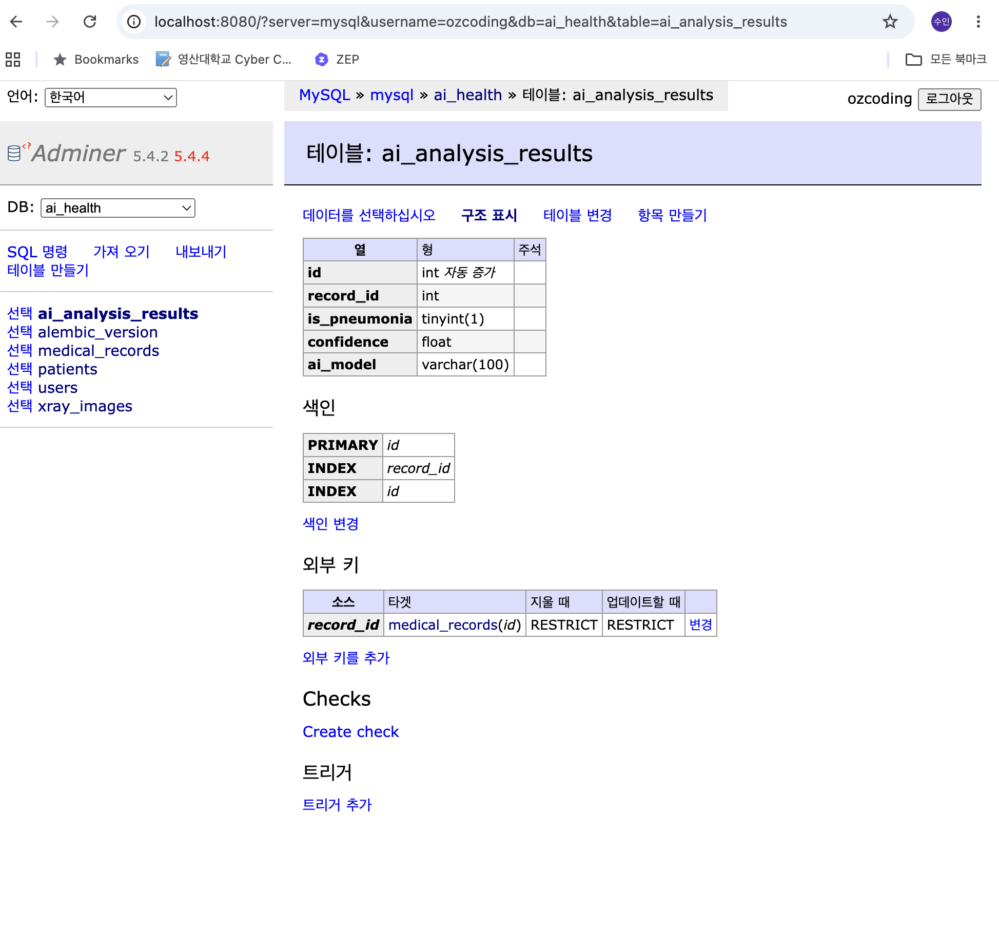
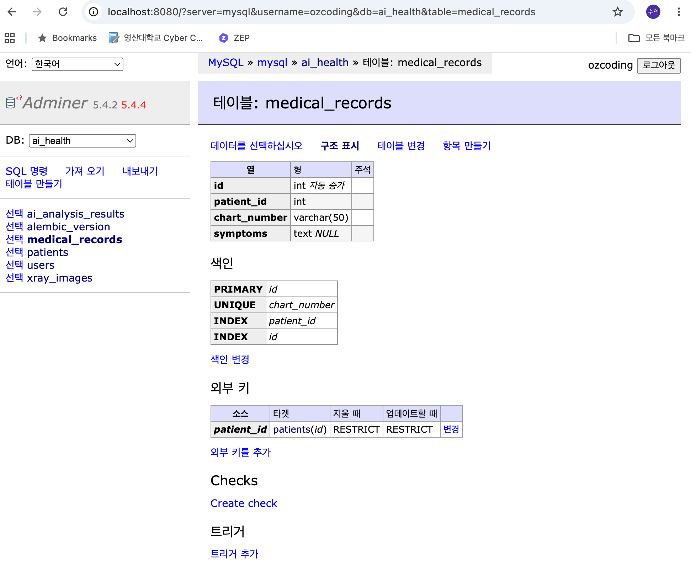
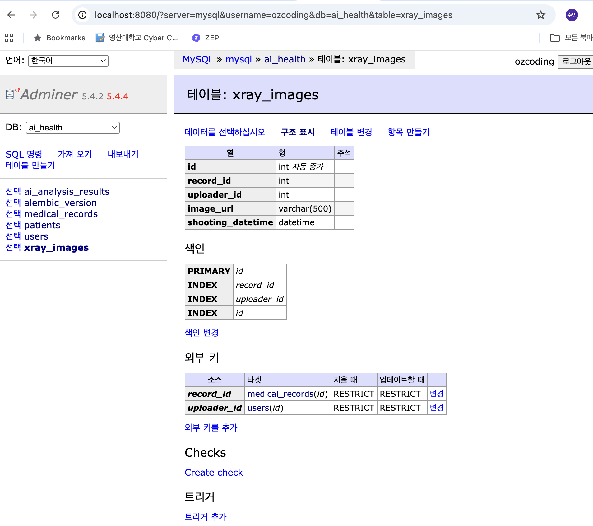

# 3일차 DB Migration

## 사용한 DB 환경

- Database: MySQL 8.0
- DB Viewer: Adminer
- 실행 방식: Docker Compose
- Database name: ai_health

## 진행 과정

1. Docker Compose로 MySQL과 Adminer를 실행했다.
2. ERD를 참고하여 SQLAlchemy ORM 모델을 작성했다.
3. Alembic으로 migration 파일을 생성했다.
4. `alembic upgrade head` 명령어로 DB에 schema를 적용했다.
5. Adminer에서 생성된 테이블과 컬럼, 외래키를 확인했다.

## 작성한 모델

- `app/models/user.py`
- `app/models/patient.py`
- `app/models/medical_record.py`
- `app/models/xray_image.py`
- `app/models/ai_analysis_result.py`

## 생성된 테이블

- `users`
- `patients`
- `medical_records`
- `xray_images`
- `ai_analysis_results`
- `alembic_version`

## 실행한 명령어

```bash
docker compose up -d mysql adminer
alembic revision --autogenerate -m "create healthcare tables"
alembic upgrade head
```

## DB Viewer 확인 이미지

### 테이블 생성 확인



### medical_records 테이블 구조



### xray_images 테이블 구조

