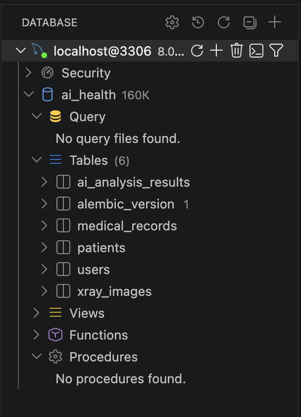

# 3일차 DB 마이그레이션 기록

프로젝트: 폐렴 환자 관리 백오피스(AI Health) · 참고 ERD: [dbdiagram.io](https://dbdiagram.io/d/ai_health_assignment-69d5f55f808962968443c041) · [Notion 원문](https://app.notion.com/p/DB-ef2638e5d63683c1b0ac8128d272f8a3)

## 1. 사용한 데이터베이스

**MySQL 8.0** (드라이버: `asyncmy`, 포트 `3306`)

- `app/core/config.py`의 `Settings`와 `docker-compose.yml`에 이미 MySQL 8.0 + `asyncmy` 비동기 드라이버로 구성되어 있어, 별도 논의 없이 템플릿에 맞춰 MySQL을 사용했습니다.
- `app/core/db/databases.py`가 `mysql+asyncmy://` 접두사로 `DATABASE_URL`을 만들고, `AsyncSession` 기반 비동기 세션(`AsyncSessionLocal`, `async_get_db`)을 제공합니다.
- 로컬 개발은 `docker-compose.yml`의 `mysql` 서비스(포트는 `.env`의 `DB_PORT`, 기본 `3306`)를 사용합니다.

## 2. ERD 요약

5개 테이블, 모두 1:N 관계로 연결됩니다.

| 관계 | 부모(1) | 자식(N) | 의미 |
|---|---|---|---|
| ① | `patients` | `medical_records` | 환자 1명이 진료기록을 여러 건 가짐 |
| ② | `medical_records` | `xray_images` | 진료기록 1건에 엑스레이 여러 장 |
| ③ | `medical_records` | `ai_analysis_results` | 진료기록 1건에 AI 분석결과 여러 건 |
| ④ | `users` | `xray_images` | 직원 1명이 엑스레이를 여러 장 업로드 |

Enum 3종: `gender {M, F}`, `role {PENDING, STAFF, ADMIN}`, `department {MEDICAL, DEV, RESEARCH}`

## 3. 작성한 모델 목록

| 파일 | 클래스 | 비고 |
|---|---|---|
| `app/models/enums.py` | `GenderEnum`, `RoleEnum`, `DepartmentEnum` | ERD의 Enum 3종 |
| `app/models/user.py` | `User` | 직원 계정. `email`·`phone_number` unique |
| `app/models/patient.py` | `Patient` | 환자. `medical_records`와 1:N (cascade delete) |
| `app/models/medical_record.py` | `MedicalRecord` | `chart_number` unique, `patient_id` FK(CASCADE) |
| `app/models/xray_image.py` | `XrayImage` | `record_id`·`uploader_id` FK 2개. `updated_at` 없음(ERD 기준) |
| `app/models/ai_analysis_result.py` | `AiAnalysisResult` | `record_id` FK(CASCADE) |
| `app/models/__init__.py` | - | Alembic이 `from app import models`로 인식하도록 전체 import 등록 |

모든 모델은 `app/core/db/databases.py`의 `Base`(`declarative_base()`)를 상속하고, `created_at`/`updated_at`이 필요한 테이블은 `app/core/db/models.py`의 `TimestampMixin`을 사용했습니다. (팀 공통 `UUIDMixin`은 사용하지 않음 — ERD가 `id integer`/`bigint`로 명시되어 있어 UUID 대신 자동증가 정수 PK를 그대로 따랐습니다.)

## 4. 마이그레이션 실행 로그

```bash
# 0. MySQL 컨테이너 실행 (아직 안 켜져 있다면)
docker compose up -d

# 1. 모델 작성 후 자동 생성
uv run alembic revision --autogenerate -m "add users, patients, medical_records, xray_images, ai_analysis_results tables"

# 2. 생성된 alembic/versions/xxxx_add_....py 검토
#    - upgrade()/downgrade() 양쪽 다 5개 테이블이 맞게 생성/삭제되는지 확인
#    - FK와 ON DELETE CASCADE가 의도대로 잡혔는지 확인
#    - Enum 컬럼이 MySQL에서 ENUM 타입으로 정상 생성되는지 확인

# 3. 실제 반영
uv run alembic upgrade head

# 4. 반영 확인
uv run alembic current
```

```
$ docker compose up -d mysql
 Container oz_codingschool-mysql-1 Started

$ uv run alembic revision --autogenerate -m "add users, patients, medical_records, xray_images, ai_analysis_results tables"
INFO  [alembic.autogenerate.compare.tables] Detected added table 'patients'
INFO  [alembic.autogenerate.compare.tables] Detected added table 'users'
INFO  [alembic.autogenerate.compare.tables] Detected added table 'medical_records'
INFO  [alembic.autogenerate.compare.tables] Detected added table 'ai_analysis_results'
INFO  [alembic.autogenerate.compare.tables] Detected added table 'xray_images'
Generating alembic/versions/07e8c9c475b3_add_users_patients_medical_records_xray_.py ...  done

$ uv run alembic upgrade head
INFO  [alembic.runtime.migration] Running upgrade  -> 07e8c9c475b3, add users, patients, medical_records, xray_images, ai_analysis_results tables

$ uv run alembic current
07e8c9c475b3 (head)
```

## 5. DB Viewer 확인 스크린샷

> ⚠️ 이 섹션은 실제로 `alembic upgrade head`를 실행한 뒤, DBeaver/TablePlus/VS Code Database Client 등으로 접속해 5개 테이블(`users`, `patients`, `medical_records`, `xray_images`, `ai_analysis_results`)과 컬럼이 생성된 화면을 캡처해서 붙여넣는 자리입니다.



체크리스트:
- [x] 5개 테이블이 모두 보이는가
- [ ] 각 테이블의 컬럼·타입이 ERD와 일치하는가
- [x] `medical_records.patient_id`, `xray_images.record_id`/`uploader_id`, `ai_analysis_results.record_id`에 FK 제약조건이 걸려 있는가 (`information_schema.KEY_COLUMN_USAGE`로 확인)
- [x] `gender`/`role`/`department` 컬럼이 ENUM 타입으로 생성됐는가 (`information_schema.COLUMNS`로 확인)

## 6. 발견한 이슈와 결정 사항

- **`xray_images`에는 `updated_at`이 없음** — ERD상 다른 테이블과 달리 생성일(`created_at`)만 존재해, `TimestampMixin`을 상속하지 않고 `created_at`만 직접 선언했습니다.
- **`uploader_id → users.id`에는 CASCADE를 걸지 않음** — 업로드한 직원 계정이 비활성화/삭제되더라도 엑스레이 기록 자체는 남아야 하므로, 이 FK만 `ON DELETE CASCADE`를 적용하지 않았습니다.
- **`patients.gender`는 nullable로 처리** — ERD에 NOT NULL 표시가 없어 선택 입력으로 두었습니다. 필수로 바꿔야 한다면 팀 논의 후 마이그레이션을 다시 생성해야 합니다.
- **`UUIDMixin` 미사용** — `app/core/db/models.py`에 `UUIDMixin`이 준비되어 있지만, ERD가 정수형 PK를 명시하고 있어 이번 5개 테이블에는 적용하지 않았습니다.
- **FK 컬럼 타입 불일치로 첫 `alembic upgrade head` 실패** — `patients.id`/`users.id`는 `Integer`인데, 이를 참조하는 `medical_records.patient_id`와 `xray_images.uploader_id`가 `BigInteger`로 선언되어 있어 MySQL이 FK 생성을 거부했습니다(`Referencing column ... incompatible`, errno 3780). `patient_id`/`uploader_id`를 참조 대상과 동일한 `Integer`로 맞춰 해결했습니다. `medical_records.id`(BigInteger)를 참조하는 `xray_images.record_id`, `ai_analysis_results.record_id`는 원래부터 타입이 일치해 문제 없었습니다.

## 7. PR 정보

- 브랜치: `feature/moonbio23`
- base: `develop`
- 포함 파일: `app/models/*.py`, `alembic/versions/*.py`, `docs/3일차_db_migration.md`, `docs/images/3일차_db_viewer.png`
- 리뷰 요청 시 확인 포인트: FK 방향, CASCADE 적용 여부, Enum 컬럼명, `app/models/__init__.py` import 누락 여부

## 참고자료

- [ERD 원본 (dbdiagram.io)](https://dbdiagram.io/d/ai_health_assignment-69d5f55f808962968443c041)
- [Notion — DB 모델 작성](https://app.notion.com/p/DB-ef2638e5d63683c1b0ac8128d272f8a3)
- [SQL (관계형) 데이터베이스 - FastAPI](https://www.joonas.io/fastapi/ko/tutorial/sql-databases/)
- [\[SQLAlchemy\] Alembic을 이용한 마이그레이션 관리 방법](https://devspoon.tistory.com/304)
