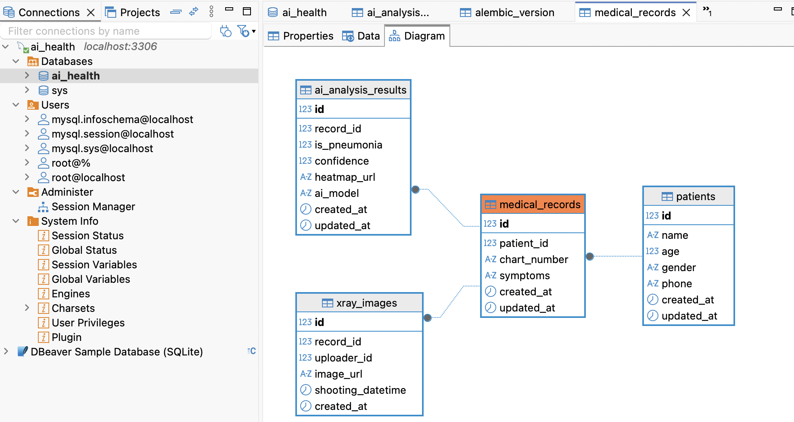

# 3일차 MySQL ORM 및 마이그레이션

## 1. MySQL 선택 이유

과제 운영 환경과 동일한 MySQL 8.0을 사용해 ENUM, `ON DELETE`, 자동 증가 등 DB 종속 동작을 실제 환경에서 검증했다.

## 2. Docker Compose

- `mysql`: `mysql:8.0`, named volume `mysql_volume`, healthcheck, 3306 포트
- `adminer`: `adminer:5`, MySQL healthy 후 시작, 8080 포트
- 기존 `fastapi`, `static_volume`, `media_volume`은 유지했다.

```bash
docker compose config
docker compose up -d mysql adminer
docker compose ps
```

## 3. 환경 변수와 DB 연결

`.env.example`에는 안전한 예시값만 두고, 실행은 Git에서 제외된 `.env`를 사용한다. 로컬 Alembic은 `DB_HOST=localhost`, Compose 내부 연결은 `DB_HOST=mysql`을 사용한다.

이 프로젝트는 비동기 SQLAlchemy이므로 `mysql+asyncmy`, `create_async_engine`, `async_engine_from_config`를 일관되게 사용한다. Alembic에 DB URL을 넣을 때 `%`를 `%%`로 이스케이프해 ConfigParser 보간 문제를 방지했다.

## 4. ORM 모델과 테이블

| 모델 | 테이블 | 주요 역할 |
|---|---|---|
| `User` | `users` | 사용자, 부서, 권한 |
| `Patient` | `patients` | 환자 기본 정보 |
| `MedicalRecord` | `medical_records` | 환자 진료 기록 |
| `XrayImage` | `xray_images` | X-ray 영상과 업로더 |
| `AIAnalysisResult` | `ai_analysis_results` | 폐렴 예측 및 신뢰도 |

SQLAlchemy 2.x의 `Mapped`, `mapped_column`, `relationship`를 사용했다. ERD의 `xray_images.uploader_id`는 `SET NULL`과 참조 PK 자료형을 맞추기 위해 `Integer`, nullable로 보정했다.

## 5. 관계와 삭제 정책

| 자식 FK | 부모 | 삭제 정책 |
|---|---|---|
| `medical_records.patient_id` | `patients.id` | `CASCADE` |
| `xray_images.record_id` | `medical_records.id` | `CASCADE` |
| `xray_images.uploader_id` | `users.id` | `SET NULL` |
| `ai_analysis_results.record_id` | `medical_records.id` | `CASCADE` |

## 6. Alembic 설정과 실행

`alembic/env.py`는 `Base.metadata`와 모든 모델을 로드하고 비동기 엔진을 사용한다.

```bash
uv run alembic revision --autogenerate -m create_initial_tables
uv run alembic upgrade head
uv run alembic current
uv run alembic history
uv run alembic check
```

생성 리비전은 `c5439fa798f8` (`create_initial_tables`)이다.

## 7. downgrade 왕복 검증

데이터가 없는 개인 로컬 DB에서만 실행했다.

```bash
uv run alembic downgrade base
uv run alembic upgrade head
uv run alembic current
```

최종 상태는 `c5439fa798f8 (head)`이고 `alembic check`는 추가 작업이 없음을 확인했다.

## 8. 실제 MySQL 스키마 검증

| 검증 항목 | 결과 |
|---|---|
| 업무 테이블 | 5개 모두 생성 |
| PK / AUTO_INCREMENT | 5개 테이블 모두 정상 |
| UNIQUE | `users.email`, `users.phone_number`, `medical_records.chart_number` |
| ENUM | gender, department, role 값 일치 |
| `Numeric(5, 2)` | MySQL `decimal(5,2)`로 생성 |
| FK 자료형 | 부모 PK와 일치 |
| 삭제 정책 | CASCADE 3개, SET NULL 1개 |
| Alembic | `c5439fa798f8` |

## 9. Adminer DB Viewer



- 주소: `http://localhost:8080`
- 서버: `mysql`
- 사용자/비밀번호/DB: `.env`의 `DB_USER`, `DB_PASSWORD`, `DB_NAME`
- 포함 테이블: 5개 업무 테이블과 `alembic_version`
- 저장 경로: `docs/images/day3_mysql_schema_adminer.png`

## 10. 오류와 해결

- 최신 main의 `practice_apis.py`에 쉘 명령이 Python 코드로 들어가고 회원 생성 함수 정의가 누락된 문법 오류가 있어, 쉘 명령을 제거하고 기존 브랜치의 함수를 복원했다.
- `pytest`는 프로젝트 의존성과 실행 환경에 없어 실행하지 못했다. 별도 테스트 파일도 확인되지 않았다.
- ERD의 `uploader_id bigint NOT NULL` + `users.id integer` + `SET NULL` 조합은 무결성 조건과 충돌해 `Integer NULL`로 보정했다.
- 기존 초기 리비전은 3개 테이블만 포함했다. 행 수가 0임을 확인한 뒤 개인 로컬 DB에서 재생성했다.

## 11. 보안과 협업 주의사항

- `.env`와 비밀번호를 커밋, 문서, PR에 포함하지 않는다.
- 기존 DB 볼륨을 임의로 삭제하지 않는다.
- 공유 DB에서 `downgrade base`를 실행하지 않는다.
- 다른 Alembic head가 생기면 병합 리비전 필요 여부를 먼저 확인한다.

## 12. 완료 체크리스트

- [x] 5개 ORM 모델 등록
- [x] MySQL 8.0 healthy
- [x] Adminer Up
- [x] 마이그레이션 생성 및 head 적용
- [x] downgrade / upgrade 왕복
- [x] `information_schema` 검증
- [x] `.env` Git 제외
- [x] Adminer 실제 화면 캡처


