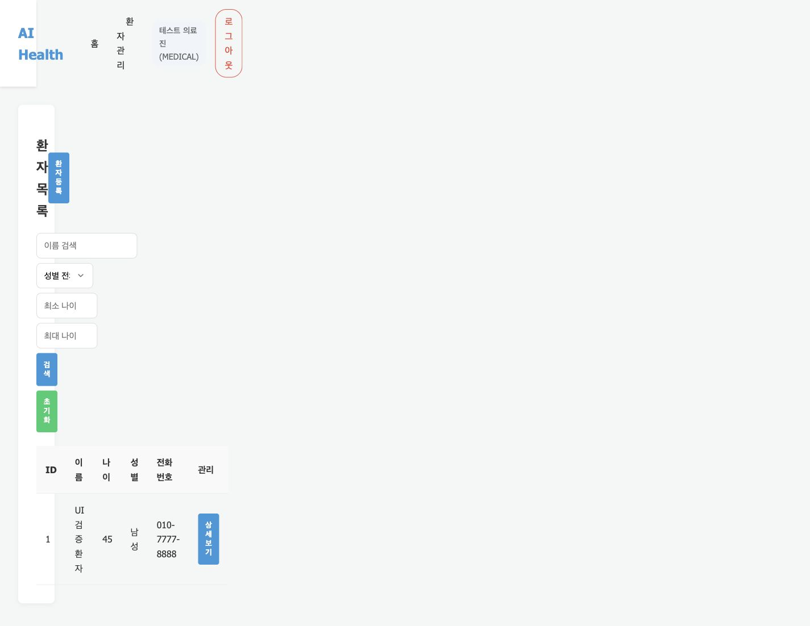
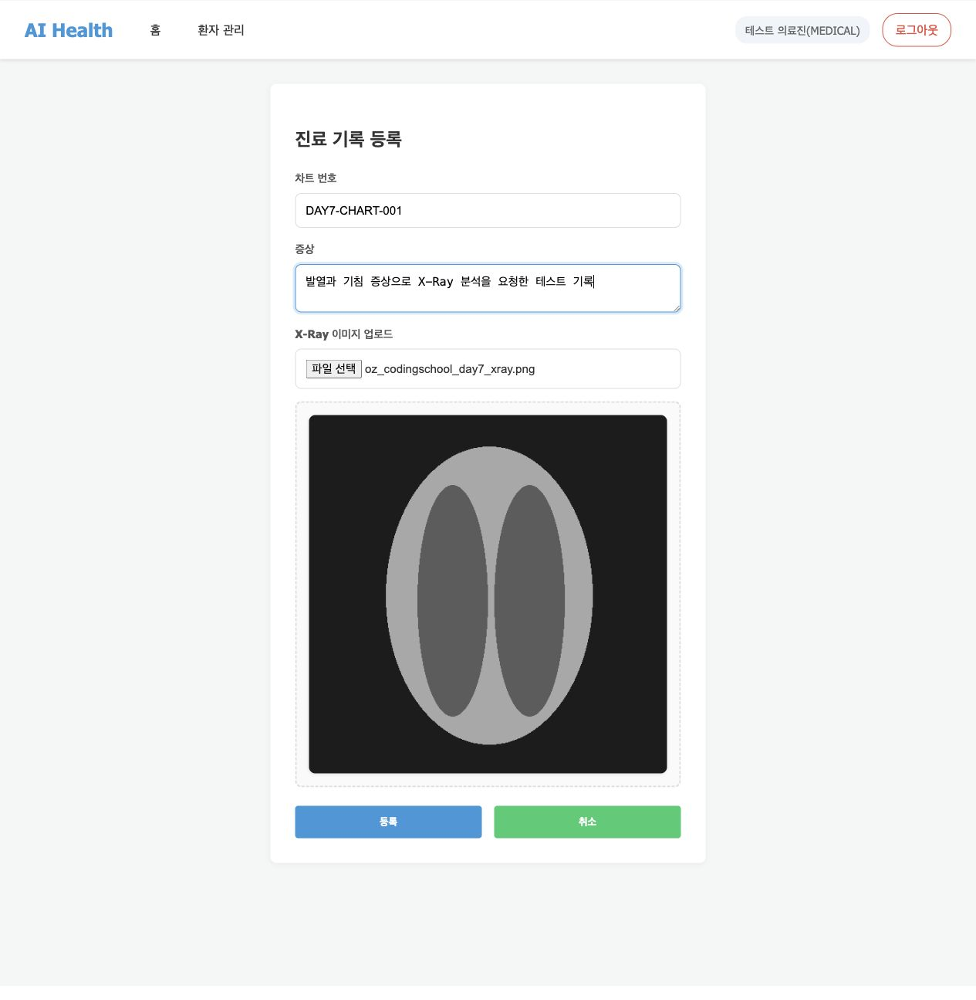
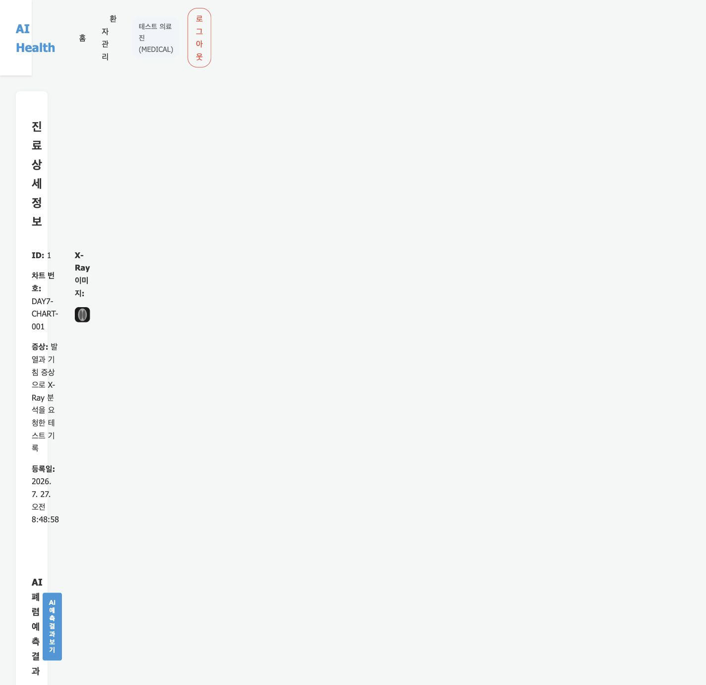

# 7일차 FastAPI 앱 실행·프론트 API 연결 확인

## 1. 과제 완료 범위

Notion의 **FastAPI 앱 실행** 가이드에 따라 정적 템플릿에서 백엔드 API를 호출하는 흐름을 점검하고, 실제 브라우저 실행 화면을 기록했다.

- 기준 브랜치: `develop`
- 실행 명령: `uv run fastapi run app/main.py`
- 접속 주소: `http://0.0.0.0:8000/`
- DB 반영 명령: `uv run alembic upgrade head`
- 테스트 데이터: 개인정보가 아닌 합성 사용자·환자 정보와 합성 PNG X-Ray 이미지

## 2. 로컬 실행 방법

```bash
cp .env.example .env
# .env에 로컬 MySQL 접속 정보와 JWT_SECRET_KEY를 입력

uv sync
uv run alembic upgrade head
uv run fastapi run app/main.py
```

브라우저에서 `http://0.0.0.0:8000/`에 접속한다. 로컬 실행은 HTTP이므로 기본 `COOKIE_SECURE=false`를 사용한다. 실제 HTTPS 배포 환경에서는 `.env`의 `COOKIE_SECURE=true`를 반드시 설정한다.

`refresh_tokens` 테이블은 로그인·토큰 갱신·로그아웃·비밀번호 변경에 필요하므로 migration을 먼저 적용해야 한다.

## 3. 프론트엔드 API 연결표

| 화면·사용자 동작 | 호출 API | 프론트 처리 |
| --- | --- | --- |
| 회원가입 | `POST /api/v1/auth/signup` | 가입 폼 JSON을 전송하고 승인 대기 계정을 생성한다. |
| 로그인 | `POST /api/v1/auth/login` | Access Token을 저장하고 사용자 역할에 따라 홈 또는 환자 목록으로 이동한다. |
| 토큰 갱신·로그아웃 | `POST /api/v1/auth/refresh`, `POST /api/v1/auth/logout` | HTTP-only Refresh Token 쿠키를 사용해 재발급·로그아웃을 처리한다. |
| 마이페이지 | `GET/PATCH/DELETE /api/v1/users/me`, `PATCH /api/v1/users/me/password` | 프로필 조회·수정·비밀번호 변경·회원 탈퇴를 처리한다. 객체형 오류 detail은 사용자 메시지로 변환한다. |
| 회원 관리 | `GET /api/v1/users`, `PATCH /api/v1/users/{user_id}/role` | 관리자 화면에서 검색·부서 필터·역할 변경을 처리한다. |
| 환자 관리 | `POST/GET /api/v1/patients`, `GET/PATCH/DELETE /api/v1/patients/{patient_id}` | 목록·검색·등록·상세·수정·삭제를 처리한다. 환자 상세 응답의 `{ data: ... }` envelope를 해제해 표시한다. |
| 진료기록 | `POST/GET /api/v1/patients/{patient_id}/medical-records`, `GET /api/v1/medical-records/{record_id}` | `FormData`로 차트 번호·증상·JPEG/PNG X-Ray를 전송하고, 상세의 X-Ray 배열을 표시한다. |
| AI 폐렴 예측 | `POST/GET /api/v1/medical-records/{record_id}/ai-predictions` | 예측 실행·캐시 결과·예측 목록을 표시한다. `0=정상`, `1=폐렴` 모델 계약에 따라 화면에는 정상 소견 또는 폐렴 의심으로 나타낸다. |

## 4. 실제 브라우저 E2E 확인

### 4.1 로그인 후 환자 목록 조회·환자 등록

의료진 역할의 테스트 계정으로 로그인한 뒤, 환자를 등록하고 목록에서 새 행이 보이는 것을 확인했다.



### 4.2 진료기록과 X-Ray 파일 업로드

진료기록 등록 화면에서 합성 PNG를 선택했다. 파일명 표시와 이미지 미리보기가 나타난 뒤 `multipart/form-data` 요청으로 등록되는 것을 확인했다.



### 4.3 진료기록 상세·AI 예측 결과

등록된 X-Ray가 진료기록 상세에 보이고, AI 예측 실행 후 결과 목록에 예측 시각·결과·신뢰도·모델명이 표시되는 것을 확인했다.



> 합성 이미지로 확인한 모델 출력은 화면·API 연동 검증용이며, 실제 의료 진단으로 사용하면 안 된다.

## 5. 이번 통합에서 보완한 항목

1. 환자 상세 API가 반환하는 `{ "data": { ... } }` 구조를 프론트가 해제하도록 수정했다.
2. 객체 형태의 오류 detail (`{ code, message }`)을 프론트가 문자열 메시지로 처리하도록 보완했다.
3. 누락된 `refresh_tokens` Alembic migration을 추가해 로그인과 Refresh Token 저장이 실제 DB에서 동작하도록 했다.
4. 로컬 HTTP FastAPI 실행 시 Refresh Token 쿠키가 저장되도록 개발 기본값을 `COOKIE_SECURE=false`로 두고, HTTPS 배포 시 `true`로 전환하는 방법을 `.env.example`에 명시했다.
5. 좁은 화면에서 메뉴·버튼 글자가 글자 단위로 줄바꿈되거나 표 열이 과도하게 좁아지는 문제를 보완했다. 메뉴·버튼은 단어 단위로 유지하고, 검색 필터는 세로로 재배치하며, 표는 카드 안에서 가로 스크롤된다.

## 6. 검증 결과

- `uv run alembic upgrade head`로 `refresh_tokens` 테이블과 인덱스 생성 확인
- 브라우저 E2E: 로그인 → 환자 등록 → 환자 상세 → X-Ray 업로드 → 진료기록 상세 → AI 예측 성공
- `node --check static/apis.js static/pages.js static/app.js` 통과
- `uv run python -m unittest discover -s tests -v` 통과
- `uv run python -m compileall -q app tests worker` 통과
- 390px 폭 브라우저 확인: 가로 페이지 넘침 없음, 헤더 너비 정상, 홈 제목 한 줄 표시
