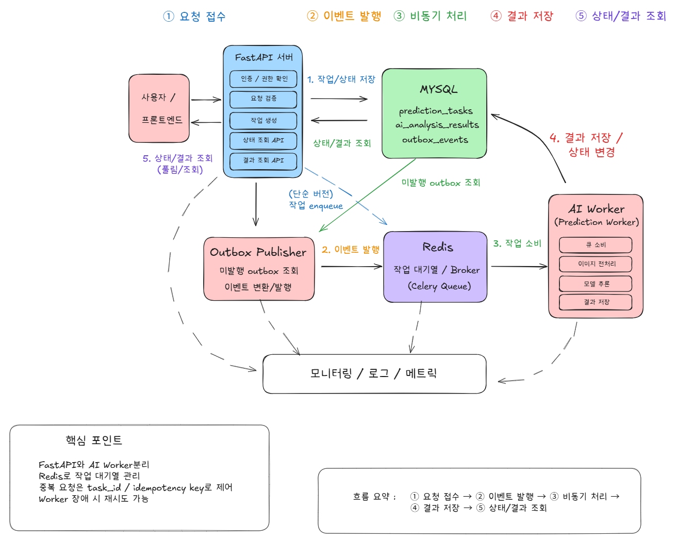

# 9일차 FastAPI·Redis 기반 Event-Driven Architecture 및 동시성 문제 해결 설계

## 1. 문서 작성 목적

본 문서는 FastAPI 기반의 폐렴 예측 서비스에서 여러 사용자가 동시에 AI 분석을 요청할 때 발생할 수 있는 응답 지연, 서버 자원 경합, 동일 진료기록에 대한 중복 추론 및 중복 결과 저장 문제를 줄이기 위한 아키텍처를 설계하는 것을 목적으로 한다. AI 모델 추론처럼 처리 시간이 길고 CPU·메모리 사용량이 큰 작업을 HTTP 요청 안에서 직접 수행하면, 요청 수가 증가할수록 FastAPI 서버의 실행 자원이 장시간 점유되고 환자 조회나 로그인처럼 비교적 가벼운 API의 응답 속도까지 저하될 수 있다. 이를 해결하기 위해 FastAPI는 요청 접수와 상태 조회를 담당하고, Redis는 처리할 작업의 대기열을 관리하며, 별도의 AI Worker는 이미지 전처리와 모델 추론 및 결과 저장을 수행하도록 책임을 분리한다. 이러한 구조를 통해 API 서버와 실제 작업 수행 주체 사이의 결합도를 낮추고, 동시에 들어온 요청을 시스템이 처리할 수 있는 범위 안에서 순차적으로 실행하며, 실패 작업의 재처리와 처리 상태 추적이 가능한 시스템을 설계하고자 한다.

> **범위 조정 안내 (2026-07-28 추가)**
> 이 문서는 최초 작성 시 Celery·Outbox 패턴·분산 락·`task_id` 폴링 API 등 운영 환경을 가정한 설계까지 폭넓게 다뤘다. 실제 1차 구현(Stage 3)에서는 개발 기간과 과제 범위를 고려해 **Celery 없이 순수 Redis(List 기반 작업 큐 + Pub/Sub 결과 전달)만으로, 그리고 `202 Accepted` + 폴링이 아니라 하나의 HTTP 요청-응답으로 완결되는 동기적 흐름으로 단순화**했다.
>
> - 결정 배경과 상세 비교: **4.4절**
> - 실제 처리 흐름: **8장**
> - 실제로 구현된 Docker 구성: **14장**
> - **9장~13장, 16장~18장**에서 다루는 Celery/Outbox 고유 개념(재시도 정책, 가시성 타임아웃, `task_id`/`celery_task_id`/`outbox_events` 테이블, 상태 폴링 API 등)은 1차 구현에는 적용하지 않았다 — 2단계(19.2절) 이후 필요성이 확인되면 검토할 **참고용 설계 스케치**로 남겨둔다. 실제 코드와 대조할 때는 이 절들의 구체적인 테이블명·API 경로·설정값을 기준으로 삼지 않는다.

---

## 2. 동시 요청 환경에서 발생할 수 있는 문제

FastAPI는 비동기 입출력 처리에 적합하지만, `async def`를 사용한다는 사실만으로 AI 모델 추론과 같은 연산 집약적 작업이 자동으로 병렬 처리되는 것은 아니다. 여러 사용자가 동시에 폐렴 예측을 요청하고 API 서버가 각 HTTP 요청 안에서 이미지 전처리, 모델 추론 및 결과 저장까지 직접 수행하면 제한된 CPU와 메모리 자원을 여러 요청이 동시에 점유하게 된다. 이 경우 예측 API뿐 아니라 로그인, 사용자 조회, 환자 조회와 같은 일반 API도 영향을 받을 수 있다.

또한 동일한 진료기록에 대한 예측 요청이 짧은 시간 안에 여러 번 들어오면 각 요청이 기존 결과의 존재 여부를 거의 동시에 확인한 뒤 모두 추론을 시작하는 경쟁 상태가 발생할 수 있다. 이때 같은 모델 연산이 불필요하게 반복되거나 데이터베이스의 유일성 제약조건과 충돌하여 일부 요청이 실패할 수 있다. FastAPI의 `BackgroundTasks`나 `asyncio.create_task()`를 이용하면 응답을 반환한 뒤 작업을 실행할 수는 있지만, 작업이 여전히 API 서버와 동일한 프로세스에 남아 있으므로 서버 재시작 시 진행 중인 작업을 잃을 수 있고, Worker 수에 맞춘 동시 실행 제한이나 여러 서버에 걸친 분산 처리도 어렵다. 따라서 예측 요청을 즉시 실행하는 대신 작업으로 접수하고, API 서버와 분리된 Worker가 Redis 대기열에서 작업을 가져가 수행하도록 구성할 필요가 있다.

---

## 3. Event-Driven Architecture의 기본 개념

Event-Driven Architecture는 한 구성요소가 다른 구성요소의 함수를 직접 호출하여 모든 처리가 끝날 때까지 기다리는 대신, 시스템에서 발생한 사건이나 수행해야 할 작업을 이벤트 또는 메시지로 발행하고 이를 소비하는 구성요소가 독립적으로 처리하는 구조이다.

본 프로젝트에서는 다음과 같이 역할을 구분한다.

- **FastAPI**: 예측 요청을 접수하는 Producer
- **Redis**: 작업 메시지를 대기시키고 Worker에 전달하는 Message Broker
- **AI Worker**: 작업을 소비하고 실제 모델 추론을 수행하는 Consumer
- **MySQL**: 작업 상태와 최종 예측 결과를 보존하는 영구 저장소

사용자가 폐렴 예측을 요청하면 FastAPI는 인증, 접근 권한, 진료기록 및 X-ray 존재 여부를 검증한다. 새로운 작업이 필요하면 작업 상태를 데이터베이스에 저장하고 Redis에 작업을 등록한 뒤, 실제 추론이 끝날 때까지 HTTP 연결을 유지하지 않고 작업 접수 결과를 반환한다. AI Worker는 Redis에서 작업을 가져와 전처리와 추론을 수행하고 최종 결과를 MySQL에 저장한다.

작업 메시지에는 이미지 파일 자체나 환자의 이름·전화번호와 같은 민감정보를 넣지 않고 `task_id`, `record_id`, `model_version`, `requested_at` 등 작업을 식별하고 추적하는 데 필요한 최소한의 정보만 포함한다. Worker는 메시지의 식별자를 바탕으로 필요한 데이터를 내부 데이터베이스와 파일 저장소에서 다시 조회한다.

---

## 4. Redis 메시징 방식 비교 및 적용 방향

Redis를 이용한 비동기 구조를 설계할 때는 Redis Pub/Sub, Redis Streams, Celery 기반 작업 큐의 목적을 구분해야 한다.

### 4.1 Redis Pub/Sub

Redis Pub/Sub은 발행 시점에 연결된 구독자에게 메시지를 빠르게 전달하는 방송 방식이다. 그러나 메시지를 영구적으로 저장하지 않으므로 Worker가 중단되거나 네트워크 연결이 끊긴 동안 발행된 작업은 복구하기 어렵다. 따라서 화면 갱신 알림이나 실시간 알림에는 사용할 수 있지만, 반드시 처리되어야 하는 AI 예측 작업의 전달 수단으로는 적합하지 않다.

### 4.2 Redis Streams

Redis Streams는 이벤트를 추가 전용 로그에 저장하고 Consumer Group을 통해 여러 Worker가 메시지를 나누어 처리할 수 있다. `XACK`으로 처리 완료 여부를 기록하고, 처리되지 않은 메시지는 Pending Entries List에서 확인하거나 다른 Consumer가 다시 선점할 수 있다. 이벤트 재생, 처리 이력 추적, 여러 소비자의 독립적 구독이 필요할 때 적합하다.

### 4.3 Celery와 Redis

Celery는 작업 등록, Worker 실행, 재시도, 작업 상태 관리, 큐 라우팅과 동시 실행 수 제어를 제공하는 Python 작업 큐 프레임워크이다. Redis를 Broker와 단기 Result Backend로 사용할 수 있으며, FastAPI와 Python 기반 AI Worker를 연결하기 쉽다.

### 4.4 최종 결정 — 순수 Redis(List + Pub/Sub), Celery 미도입

검토 초기에는 4.3절과 같이 Celery + Redis 조합을 1차 구현으로 우선 적용하는 방향을 고려했다. 그러나 실제 Stage 3 구현을 진행하면서 아래 이유로 **Celery를 도입하지 않고 Redis List(`RPUSH`/`BLPOP`)와 Pub/Sub만으로 직접 큐잉 로직을 구현**하는 쪽으로 최종 결정했다.

**결정 이유**

1. **과제 요구사항이 Celery의 비동기 작업 상태 조회 모델을 요구하지 않는다.** Stage 3 과제 명세는 "FastAPI가 Redis 작업 큐에 작업을 등록한 뒤 결과를 Subscribe하여 응답으로 반환한다"고 명시한다. 즉 클라이언트는 `POST .../predict` 요청 하나로 최종 결과까지 **한 번의 HTTP 응답**으로 받는 동기적 흐름이며, Celery가 전제하는 "`202 Accepted` + `task_id` 반환 + 별도 상태 조회 API 폴링" 모델과는 다르다. Celery의 핵심 가치(비동기 작업 상태 관리)를 쓸 필요가 없는 상황에서 프레임워크만 얹으면 오히려 구조가 복잡해진다.
2. **팀 전원이 처음 다루는 기술이고 남은 기간이 짧다.** Celery는 Broker/Result Backend 설정, Task 등록과 모듈 경로 문제, Worker 실행 명령(`celery -A ... worker`), 직렬화 설정 등 그 자체로 학습 곡선이 있다. 마감을 하루 앞둔 시점에 새 프레임워크를 도입하면 디버깅 리스크가 커진다. 반면 Redis List(`RPUSH`/`BLPOP`)와 Pub/Sub은 Redis 커맨드 수준이라 원리를 그대로 이해하고 통제할 수 있다.
3. **다중 워커 지원(Stage 3 필수 요구사항)은 Celery 없이도 충족된다.** `BLPOP`은 Redis가 원자적으로 보장하는 명령이라, 여러 `ai-worker` 컨테이너가 동시에 떠 있어도 같은 작업을 두 워커가 동시에 가져가지 않는다. Celery가 제공하는 큐 분배 기능을 별도로 쓰지 않아도 이 요구사항은 그대로 만족한다.
4. **동시 요청 중복 방지, 워커 비정상 종료 복구는 과제에서 "선택" 항목이다.** Celery가 강점을 갖는 부분(재시도 정책, 가시성 타임아웃, 작업 상태 영속화)은 대부분 이 "선택" 요구사항과 맞닿아 있다. 선택 항목까지 처리하기 위해 필수 항목 구현 방식(Celery 전체 도입)을 무겁게 가져가는 것은 우선순위가 맞지 않는다고 판단했다.
5. **기존 캐시 로직과 자연스럽게 이어진다.** Stage 6에서 이미 `record_id + ai_model` 조합에 DB unique 제약을 걸어 중복 저장을 방지하는 로직이 구현돼 있다. Celery의 `idempotency_key`/작업 상태 테이블 같은 별도 장치를 새로 만들지 않아도, 기존 DB 제약 + Redis 큐잉만으로 Stage 3 요구사항을 충족할 수 있다.

**트레이드오프로 포기한 것**

- 워커가 다운돼도 작업이 자동으로 재전달되는 기능(Celery의 `task_acks_late`, 가시성 타임아웃) — 필요해지면 향후 검토
- 요청/결과를 MySQL에 영속화해 Redis 재시작에도 진행 상태를 잃지 않는 구조(Outbox 패턴) — 지금은 Redis Pub/Sub 특성상 결과 발행 시점에 FastAPI가 구독 중이지 않으면 유실될 수 있음. 다만 현재 흐름은 FastAPI가 같은 요청 처리 중 계속 구독 상태를 유지하므로 실질적인 영향은 제한적이다.
- Prometheus/OpenTelemetry 기반 모니터링, Dead Letter 큐, 세밀한 Worker 동시성 튜닝 — 3단계(확장)로 미룸

Redis Streams는 여전히 검토 대상은 아니다. 이벤트 재생이나 여러 소비자의 독립적 구독처럼 Streams가 강점을 갖는 요구사항 자체가 이번 과제 범위에 없기 때문에, 3단계(확장)에서 필요해질 때만 별도로 검토한다.

---

## 5. 최종 권장 아키텍처 (1차 구현)

본 프로젝트 1차 구현에는 FastAPI, MySQL, Redis, AI Worker(`ai-worker` 컨테이너)를 중심으로 한 **동기적 요청-응답 + Redis 작업 큐** 구조를 적용한다. Celery나 Outbox 패턴은 도입하지 않는다 (4.4절 참고).

1. 사용자가 폐렴 예측 API(`POST /api/v1/medical-records/{record_id}/predict`)를 호출한다.
2. FastAPI가 인증, 권한, 진료기록과 X-ray 존재 여부를 확인한다.
3. FastAPI가 동일한 진료기록과 모델(`record_id + ai_model`)의 기존 결과를 DB에서 조회한다. 있으면 즉시 그 결과를 반환한다.
4. 기존 결과가 없으면 FastAPI가 Redis List(`prediction:tasks`)에 작업을 `RPUSH`하고, 고유한 `request_id` 기준 결과 채널(`prediction:result:{request_id}`)을 `SUBSCRIBE`한다.
5. AI Worker가 `BLPOP`으로 Redis에서 작업을 가져온다.
6. Worker가 X-ray 이미지 전처리와 AI 모델 추론을 수행한다.
7. Worker가 결과를 `prediction:result:{request_id}` 채널에 `PUBLISH`한다.
8. FastAPI는 구독 중이던 채널에서 결과를 받아 MySQL에 저장하고, **같은 HTTP 요청의 응답으로** 최종 결과를 반환한다 (Celery식 `202 Accepted` + 상태 폴링이 아니라 하나의 요청-응답 안에서 완결됨).

FastAPI는 HTTP 요청 처리에 집중하고 AI 모델을 직접 실행하지 않는다. AI Worker는 외부 HTTP 요청을 직접 받지 않고 Redis에서 전달된 작업만 처리한다. Redis는 대기 중인 작업과 결과 전달을 중개하는 역할만 하며, MySQL은 최종 결과의 단일 기준(source of truth)으로 사용한다.

---

## 6. Event-Driven Architecture 전체 구성도

아래 구성도는 FastAPI 서버와 AI Worker의 책임을 분리하고, Redis를 작업 대기열로 활용하여 동시 요청을 안정적으로 처리하는 전체 흐름을 나타낸다.



> **그림 1. 동시성 문제 해결을 위한 Event-Driven Architecture**  
> FastAPI는 요청 접수를 담당하고, Redis는 작업 대기열과 결과 전달을 관리하며, AI Worker는 이미지 전처리와 모델 추론을 수행한다. MySQL은 최종 예측 결과를 영구적으로 저장한다.
>
> [Excalidraw 원본 편집본 열기](https://excalidraw.com/#json=1SQa7kbCxZhVojeOp61Mg,en9TZtlFB4vAHPFsEaNHtA)
>
> **주의:** 이 이미지는 최초 설계 당시(Outbox Publisher 경로 포함) 그린 것이다. 1차 구현에서는 4.4절 결정에 따라 Outbox 경로를 도입하지 않았으므로, 실제 흐름은 아래 텍스트 설명(FastAPI → Redis → AI Worker → Redis → FastAPI, 하나의 요청-응답 안에서 완결)을 기준으로 봐야 한다.

구성도의 주요 처리 순서는 다음과 같다 (1차 구현 기준).

1. **요청 접수**: 사용자 또는 프론트엔드가 FastAPI에 예측을 요청한다.
2. **작업 등록**: 캐시된 결과가 없으면 FastAPI가 Redis List에 작업을 등록하고 결과 채널을 구독한다.
3. **작업 처리**: AI Worker가 Redis에서 작업을 가져와 모델 추론을 수행한다.
4. **결과 전달**: Worker가 결과를 Redis 채널에 발행하고, FastAPI가 이를 받아 MySQL에 저장한다.
5. **응답 반환**: FastAPI가 같은 HTTP 요청의 응답으로 최종 결과를 반환한다. 별도의 상태 조회 API 폴링은 없다.

---

## 7. 구성요소별 책임과 경계

### 7.1 사용자 및 프론트엔드

프론트엔드는 폐렴 예측 요청을 전송하고, 하나의 HTTP 요청-응답 안에서 최종 결과(또는 오류)를 받는다. 1차 구현에는 `task_id` 기반 별도 상태 조회 API나 폴링이 없다 — 요청이 완료될 때까지 클라이언트가 응답을 기다린다.

### 7.2 FastAPI

FastAPI는 다음 책임을 가진다.

- 사용자 인증 및 권한 확인
- 진료기록과 X-ray 존재 여부 검증
- 기존 결과 조회 (`record_id + ai_model` 기준 캐시 확인)
- Redis에 새 예측 작업 등록 및 결과 대기
- 결과를 MySQL에 저장하고 응답으로 반환

FastAPI는 이미지 전처리와 모델 추론을 수행하지 않는다.

### 7.3 Redis

Redis는 다음 역할을 담당한다 (Celery Broker가 아니라 순수 List + Pub/Sub, 4.4절 참고).

- `prediction:tasks` List에 대기 중인 작업 보관 (`RPUSH`/`BLPOP`)
- `prediction:result:{request_id}` 채널로 워커의 결과를 FastAPI에 전달 (Pub/Sub)

Redis는 환자 정보와 최종 예측 결과를 영구적으로 저장하는 데이터베이스로 사용하지 않으며, 작업 상태 이력도 보관하지 않는다 (결과 발행 후 채널 메시지는 소비되면 사라짐).

### 7.4 AI Worker

AI Worker는 다음 책임을 가진다.

- Redis 작업 큐 소비 (`BLPOP`)
- X-ray 이미지 조회 및 전처리
- AI 모델 추론
- 결과를 Redis 결과 채널에 발행 (`PUBLISH`)
- 임시 파일과 자원 정리

Worker는 외부 클라이언트의 HTTP 요청을 직접 받지 않으며, MySQL에 직접 쓰지 않는다 — 결과 저장은 FastAPI가 담당한다.

### 7.5 MySQL

MySQL은 사용자, 환자, 진료기록과 최종 AI 분석 결과(`ai_analysis_results`)를 보존하는 영구 저장소이다. 1차 구현에는 별도의 예측 작업 상태 테이블이나 Outbox 이벤트 테이블을 두지 않는다 — 클라이언트에게 제공하는 공식 결과는 `ai_analysis_results`를 기준으로 판단한다.

### 7.6 (미적용) Outbox Publisher

Outbox 패턴은 1차 구현에 도입하지 않는다. 아래는 향후 안정성을 강화할 때 검토할 내용이다: Outbox Publisher는 MySQL의 미발행 이벤트를 안전하게 선점해 Redis에 전달하고 발행 완료 여부를 기록한다.

### 7.7 모니터링 시스템

모니터링 시스템은 FastAPI의 응답 시간, Redis 큐의 적체, Worker의 처리 시간과 실패율을 수집한다. 작업 상태를 직접 수정하거나 실패한 작업을 임의로 재실행하지 않는다.

---

## 8. 폐렴 예측 요청의 처리 흐름 (1차 구현)

클라이언트가 `POST /api/v1/medical-records/{record_id}/predict`를 호출하면 FastAPI는 사용자 인증과 접근 권한, 진료기록 및 X-ray 이미지의 존재 여부를 검증한다. 이후 `record_id`와 `ai_model`의 조합으로 이미 완료된 결과가 있는지 확인한다.

동일한 조합의 결과가 이미 존재하면 그 결과를 즉시 반환한다(`cached: true`). 결과가 없으면 고유한 `request_id`를 생성해 Redis의 `prediction:tasks` List에 작업을 `RPUSH`하고, `prediction:result:{request_id}` 채널을 구독한 채로 결과를 기다린다.

Worker는 큐에서 작업을 가져오면(`BLPOP`) 이미지 경로를 조회한 뒤 전처리와 모델 추론을 수행한다. 성공하면 `{"status": "ok", "is_pneumonia", "confidence"}`를, 실패하면 `{"status": "error", "error": "invalid_xray_image"|"prediction_failed"}`를 결과 채널에 발행한다.

FastAPI는 구독 중이던 채널에서 이 메시지를 받아 성공이면 `ai_analysis_results`에 저장하고, 실패면 해당하는 HTTP 오류(422/500/503)로 변환한다. 일정 시간(`RESULT_WAIT_TIMEOUT_SECONDS`) 안에 응답이 없으면 `503 model_unavailable`로 응답한다. 이 모든 과정은 **클라이언트의 최초 요청 하나에 대한 응답으로** 완결되며, 별도의 상태 조회 API나 `task_id` 폴링은 1차 구현에 없다.

---

## 9. 동시성 제어와 멱등성 보장

메시지 큐를 도입해도 동일한 요청이 여러 API 서버에 거의 동시에 도착하거나 Worker 장애로 같은 작업이 다시 전달될 수 있다. 따라서 중복 실행이 절대 발생하지 않는다고 가정하기보다, 같은 작업이 반복되어도 최종 결과가 달라지지 않는 멱등성을 보장해야 한다.

FastAPI는 `record_id`와 `model_version`을 조합하여 `idempotency_key`를 생성한다. 데이터베이스 트랜잭션 안에서 해당 키에 대응하는 진행 중 작업이나 기존 결과를 조회한 뒤 새로운 작업 생성 여부를 결정한다. 두 요청이 동시에 사전 조회를 통과하더라도 데이터베이스의 유일성 제약조건이 동일한 조합의 작업이나 결과가 중복 저장되는 것을 차단해야 한다. 뒤늦게 충돌한 요청은 일반 서버 오류로 처리하지 않고 먼저 저장된 작업 또는 결과를 다시 조회하여 반환한다.

Redis 분산 락은 `prediction:lock:{record_id}:{model_version}`과 같은 키를 `SET key value NX PX timeout` 방식으로 생성하여 불필요한 동시 추론을 줄이는 보조 장치로 사용할 수 있다. 다만 Redis 락만으로 데이터 정합성을 보장해서는 안 된다. 락 값에는 요청마다 생성한 고유 토큰을 저장하고, 해제할 때에도 현재 값이 자신의 토큰과 일치할 때만 원자적으로 삭제해야 한다.

Worker는 작업을 시작하기 전에 데이터베이스에서 상태를 다시 확인한다. 이미 `SUCCESS`인 작업은 추론을 반복하지 않고 종료하며, 자신이 처리할 수 있는 `PENDING`, `QUEUED`, `RETRY` 상태만 `STARTED`로 전환한다. 결과 저장과 작업 상태의 `SUCCESS` 변경은 하나의 데이터베이스 트랜잭션으로 처리한다.

정리하면 다음과 같이 책임을 나눈다.

- **Redis 락**: 불필요한 중복 계산 감소
- **데이터베이스 유일성 제약조건**: 중복 저장 차단
- **Worker 멱등성**: 메시지 재전달과 장애 복구 수용

---

## 10. 재시도, 타임아웃 및 실패 작업 격리

재시도 정책은 모든 오류를 무조건 반복하는 방식이 아니라, 다시 실행했을 때 성공할 가능성이 있는 일시적 오류와 입력을 수정하지 않으면 계속 실패하는 영구적 오류를 구분해야 한다.

다음과 같은 오류에는 제한된 자동 재시도를 적용할 수 있다.

- Redis 연결 중단
- 일시적인 데이터베이스 연결 실패
- 파일 저장소의 순간적인 응답 지연

Celery의 `autoretry_for`, `max_retries`, `retry_backoff`, `retry_backoff_max`, `retry_jitter`를 이용하면 지수 백오프와 임의 지연을 적용할 수 있다. 반면 다음 오류는 같은 데이터로 다시 실행해도 해결되지 않으므로 재시도하지 않는다.

- 존재하지 않는 진료기록
- 지원하지 않는 이미지 형식
- 손상된 X-ray 파일
- 권한 부족
- 모델 입력 검증 실패

모델 추론이나 파일 접근이 무기한 지속되지 않도록 작업에는 soft time limit와 hard time limit을 설정한다. Soft limit에 도달하면 Worker가 임시 파일 정리와 상태 기록을 시도하고, hard limit에서는 실행을 강제로 종료한다. 제한 시간은 실제 X-ray 전처리와 추론 시간을 측정한 뒤 정상 요청이 지나치게 중단되지 않는 범위로 결정한다.

최대 재시도 횟수를 모두 소진한 작업은 일반 대기열에 계속 남기지 않고 `FAILURE` 또는 `DEAD_LETTER` 상태로 격리한다. 이때 `task_id`, `record_id`, 실패 단계, 시도 횟수, 마지막 오류 코드와 실패 시각을 저장하되 환자 개인정보나 전체 예외 메시지는 작업 테이블에 기록하지 않는다.

---

## 11. 전달 보장과 트랜잭셔널 아웃박스 패턴

FastAPI가 MySQL에 작업을 저장한 뒤 Redis에 Celery 메시지를 발행하는 두 동작은 서로 다른 시스템에서 수행되므로 하나의 원자적 트랜잭션으로 묶이지 않는다. 데이터베이스 저장에는 성공했지만 Redis 발행에 실패하면 화면에는 접수된 작업이 존재하면서도 Worker가 이를 전달받지 못할 수 있다. 반대로 메시지를 먼저 발행한 뒤 데이터베이스 저장이 실패하면 Worker가 존재하지 않는 작업을 소비할 수 있다.

초기 구현에서는 작업 저장 후 Redis 발행이 실패할 경우 작업 상태를 오류로 기록하고 제한적으로 다시 발행하는 방식으로 시작할 수 있다. 운영 안정성이 중요해지면 트랜잭셔널 아웃박스 패턴을 적용한다.

예측 작업을 생성할 때 `prediction_tasks` 행과 `outbox_events` 행을 MySQL의 동일한 트랜잭션 안에서 저장한다. 별도의 Outbox Publisher는 아직 발행되지 않은 이벤트를 조회하여 Redis에 전달한 뒤 발행 완료 시각과 시도 횟수를 기록한다. Redis가 일시적으로 중단되더라도 미발행 이벤트는 MySQL에 남아 있으므로 복구 이후 다시 전달할 수 있다.

Publisher가 Redis 발행에는 성공했지만 발행 완료 표시를 저장하기 전에 중단되면 같은 이벤트가 다시 전달될 수 있다. 따라서 아웃박스 패턴은 정확히 한 번 실행을 보장하기보다 **최소 한 번 전달과 멱등한 소비를 결합하여 작업 유실을 방지하는 방식**으로 이해해야 한다.

---

## 12. 작업 상태 저장과 데이터 모델

Redis Result Backend를 설정하면 Celery의 작업 상태를 빠르게 확인할 수 있지만, Redis 키에는 만료 시간이 적용되거나 메모리 정책과 장애로 데이터가 사라질 수 있다. 따라서 사용자에게 제공되는 공식 작업 상태와 최종 결과는 MySQL에 저장한다.

`prediction_tasks` 테이블에는 다음과 같은 정보를 저장할 수 있다.

| 컬럼 | 설명 |
|---|---|
| `task_id` | 서비스 내부 작업 식별자 |
| `celery_task_id` | Celery 작업 식별자 |
| `idempotency_key` | 중복 요청 판별 키 |
| `record_id` | 진료기록 식별자 |
| `model_version` | 사용한 모델 버전 |
| `requested_by` | 요청 사용자 식별자 |
| `status` | 작업 상태 |
| `retry_count` | 재시도 횟수 |
| `error_code` | 정제된 오류 코드 |
| `queued_at` | 큐 등록 시각 |
| `started_at` | 처리 시작 시각 |
| `completed_at` | 처리 완료 시각 |
| `created_at` | 작업 생성 시각 |
| `updated_at` | 마지막 변경 시각 |

아래 상태값은 Celery Result Backend의 내장 상태를 그대로 사용하는 것이 아니라, 본 서비스가 MySQL에서 관리하는 애플리케이션 작업 상태로 정의한다.

정상 상태 흐름은 다음과 같다.

```text
PENDING → QUEUED → STARTED → SUCCESS
```

재시도와 실패 흐름은 다음과 같다.

```text
STARTED → RETRY → QUEUED
STARTED → FAILURE
RETRY → DEAD_LETTER
```

최종 예측값, 신뢰도, 모델 버전과 생성 시각은 `ai_analysis_results`와 같은 결과 테이블에 저장한다. 결과 행 생성과 작업 상태의 `SUCCESS` 변경은 하나의 트랜잭션으로 처리하여 결과는 존재하지만 상태는 실행 중으로 남거나, 상태는 성공인데 결과가 없는 불일치를 방지한다.

---

## 13. Worker 동시 실행 제한과 역압력 설계

Worker가 처리할 수 있는 속도보다 빠르게 요청을 계속 받아들이면 Redis 대기열이 증가하고 처리 지연과 메모리 사용량도 함께 커질 수 있다. 따라서 시스템 처리 능력에 맞춘 동시 실행 제한과 역압력 정책이 필요하다.

AI 모델은 Worker 프로세스마다 메모리에 적재될 수 있으므로 CPU 개수만 보고 `concurrency`를 높이면 메모리 부족이나 과도한 문맥 전환이 발생할 수 있다. 초기 운영에서는 예측 전용 큐인 `prediction`과 관리 작업을 위한 `maintenance` 큐를 분리하고, 예측 Worker는 `concurrency=1`에서 시작한다. 이후 실제 모델 메모리 사용량과 평균·최대 처리 시간을 측정하여 단계적으로 늘린다.

긴 작업을 Worker가 필요 이상으로 미리 가져가는 것을 줄이기 위해 `worker_prefetch_multiplier=1`을 적용한다. 멱등성이 보장된 작업에는 `task_acks_late=True`를 적용하여 작업 완료 후 메시지를 확인하도록 구성할 수 있다. 다만 Worker 장애 시 작업이 다시 실행될 수 있으므로 멱등성 검증이 반드시 선행되어야 한다.

Redis Broker의 `visibility_timeout`은 정상적인 최대 추론 시간보다 짧지 않게 설정해야 한다. 실행 중인 작업이 이 시간을 넘기면 아직 처리 중인 메시지가 다른 Worker에 다시 전달되어 중복 실행될 수 있다. 반대로 값을 지나치게 길게 설정하면 Worker 강제 종료 시 유실 작업의 재전달이 늦어질 수 있으므로, 실제 최대 처리 시간과 장애 복구 목표를 기준으로 결정한다. `task_reject_on_worker_lost=True`는 갑자기 종료된 Worker 프로세스의 작업을 다시 큐에 넣는 데 사용할 수 있지만, 반복 실패에 따른 메시지 순환을 막기 위해 제한된 재시도와 Dead Letter 처리를 함께 적용해야 한다.

FastAPI는 다음 지표를 이용해 현재 적재량을 판단한다.

- `PENDING`, `QUEUED`, `STARTED`, `RETRY` 작업 수
- Redis 큐 길이
- 가장 오래 기다린 작업의 대기 시간
- Worker 가동 여부
- 최근 작업 완료율과 실패율

처리 한도를 넘으면 무조건 새 작업을 쌓지 않고, 사용자별 과도한 요청에는 HTTP `429 Too Many Requests`, Worker 부재나 전체 시스템 포화에는 HTTP `503 Service Unavailable`과 `Retry-After` 헤더를 반환한다. 같은 진료기록과 모델 버전으로 이미 진행 중인 작업이 있다면 새 작업을 추가하지 않고 기존 `task_id`를 반환한다.

---

## 14. Docker Compose 기반 서비스 구성 (실제 구현)

기존 FastAPI, MySQL, Adminer 구성에 아래 두 서비스를 실제로 추가했다 (Celery 관련 서비스는 도입하지 않음, 4.4절 참고).

- `redis` — `redis:7-alpine` 이미지, 헬스체크 포함
- `ai-worker` — `worker/Dockerfile`로 별도 빌드, `worker/` 소스만 이미지에 포함

FastAPI 컨테이너는 요청 접수만 담당하고 AI 모델(torch)을 이미지에 포함하지 않는다 (`pyproject.toml`에서 torch/numpy/pillow를 `ai` extra로 분리). Redis 컨테이너는 순수 List/Pub·Sub 브로커 역할만 하며 별도 Celery Broker 설정은 없다. `ai-worker`는 fastapi와 별도 이미지로 빌드되고, `./media:/app/media` 볼륨만 fastapi와 공유한다 — app 소스코드나 `.env`는 워커 이미지/컨테이너에 노출하지 않는다.

서비스 시작 순서는 다음과 같이 구성한다.

1. MySQL과 Redis 시작
2. MySQL과 Redis Health Check 통과
3. FastAPI, `ai-worker` 시작 (`ai-worker`는 `redis` 헬스체크에만 의존)

FastAPI 인스턴스 수와 AI Worker 수는 서로 독립적으로 확장할 수 있다. 예측 대기 시간이 늘어나면 `docker compose up -d --scale ai-worker=N`으로 워커만 늘린다 — `BLPOP`의 원자성 덕분에 여러 워커가 떠 있어도 같은 작업을 중복 처리하지 않는다.

---

## 15. 보안 설계

Redis와 Celery는 외부 사용자가 직접 접근하는 공개 서비스가 아니라 FastAPI, Outbox Publisher와 Worker만 연결하는 내부 인프라로 운영한다. 운영 환경에서는 Redis 포트를 인터넷에 노출하지 않고 내부 Docker Network 또는 사설망에서만 접근하도록 한다.

Redis ACL을 이용해 서비스별 사용자를 만들고 실행 가능한 명령과 키 패턴을 최소화한다. `CONFIG`, `FLUSHALL`, `FLUSHDB`처럼 운영에 불필요하거나 위험한 명령은 허용하지 않는다. 신뢰할 수 없는 네트워크 구간을 통과한다면 TLS와 인증서 검증을 적용한다.

Redis 비밀번호, Celery Broker URL, 데이터베이스 비밀번호와 JWT 비밀키는 Git 저장소에 기록하지 않고 환경변수 또는 Secret 관리 기능으로 주입한다. 로그에는 Redis 전체 연결 문자열, Authorization 헤더, 쿠키와 Celery 메시지 본문이 출력되지 않도록 마스킹한다.

Celery 메시지는 JSON 직렬화를 기본으로 사용하고 `task_serializer="json"`, `accept_content=["json"]` 등을 적용한다. 메시지에는 환자 이름, 전화번호, 증상 전문, 이미지 바이트를 담지 않고 `task_id`, `record_id`, `model_version` 등 최소한의 식별자만 포함한다.

Worker가 X-ray 파일을 읽을 때는 메시지에 포함된 임의의 파일 경로나 URL을 직접 신뢰하지 않고 데이터베이스에 등록된 내부 경로를 조회한 뒤 허용된 저장 디렉터리 내부인지 다시 검증한다.

---

## 16. 로그, 메트릭 및 장애 감지

FastAPI, Redis와 Worker가 분리된 구조에서는 하나의 예측 요청을 여러 프로세스에서 처리하므로 공통 식별자를 이용한 추적이 필요하다. 예측 요청을 접수할 때 생성한 `request_id`, `task_id`, `record_id`를 FastAPI 로그, Outbox 이벤트, Celery 메시지, Worker 로그와 데이터베이스 작업 이력에 공통으로 포함한다.

로그는 다음 정보를 포함한 구조화된 JSON 형식으로 남긴다.

- `timestamp`
- `service`
- `environment`
- `event`
- `request_id`
- `task_id`
- `record_id`
- `model_version`
- `worker_name`
- `retry_count`
- `duration_ms`
- `status`
- `error_code`

비밀번호, Access Token, Refresh Token, 환자 이름, 전화번호와 원본 이미지 경로는 기록하지 않는다.

다음 메트릭을 수집한다.

- API 요청 수와 응답 시간
- 예측 작업 생성·완료·실패 수
- 재시도 횟수
- 큐 대기 시간
- 모델 추론 시간
- 진행 중 작업 수
- Redis 큐 길이
- Worker Heartbeat
- Worker 메모리 사용량

알림은 오류 로그 한 건마다 발생시키기보다 일정 시간 동안 실패율이 기준을 초과하거나, 가장 오래된 작업의 대기 시간이 허용 범위를 넘거나, Worker Heartbeat가 끊기거나, 큐 길이가 계속 증가하는 조건을 기준으로 설정한다.

---

## 17. 상황별 처리 시나리오

### 17.1 정상 처리

FastAPI가 작업을 생성하고 `202 Accepted`와 `task_id`를 반환한다. Redis에 등록된 작업을 Worker가 소비해 전처리와 추론을 수행한다. Worker는 결과와 `SUCCESS` 상태를 MySQL에 저장하고, 사용자는 상태 조회 API에서 최종 결과를 확인한다.

### 17.2 동일 요청의 동시 발생

FastAPI는 `record_id`와 `model_version`을 기준으로 생성한 `idempotency_key`를 조회한다. 이미 진행 중인 작업이 있으면 새로운 이벤트를 만들지 않고 기존 `task_id`를 반환한다. 두 API 인스턴스가 동시에 사전 조회를 통과해도 데이터베이스 유일성 제약조건이 중복 생성을 차단한다.

### 17.3 Worker 장애

Worker가 작업 완료 전에 종료된 경우 작업이 다시 전달되도록 `task_acks_late`와 Redis Broker의 재전달 설정을 함께 검토한다. 실행 중인 자식 프로세스가 갑자기 종료된 작업까지 다시 큐에 넣으려면 `task_reject_on_worker_lost`를 선택적으로 적용할 수 있지만, 반복 실패 작업이 무한히 재전달되지 않도록 재시도 횟수와 실패 격리 정책을 함께 둔다. 재전달된 작업은 기존 상태와 결과를 먼저 확인하여 중복 추론과 중복 저장을 방지한다.

### 17.4 Redis 장애

Outbox 패턴을 사용하는 경우 미발행 이벤트는 MySQL에 남고, Redis가 복구된 뒤 Publisher가 다시 발행한다. 초기 구현에서 Outbox를 적용하지 않았다면 Redis 발행 실패를 작업 상태에 기록하고 제한된 재발행 처리를 수행한다.

### 17.5 영구 오류

손상된 X-ray, 존재하지 않는 진료기록, 지원하지 않는 파일 형식은 재시도하지 않고 `FAILURE`로 종료한다. 사용자에게는 정제된 오류 코드만 제공한다.

---

## 18. 동시성 및 장애 복구 테스트 계획

설계 검증을 위해 다음 테스트를 수행한다.

1. 동일한 `record_id`와 `model_version`으로 여러 요청을 동시에 전송한다.
2. 모든 응답이 하나의 기존 `task_id`를 반환하거나, 데이터베이스에 작업과 결과가 한 건만 생성되는지 확인한다.
3. 서로 다른 진료기록 요청이 Redis 대기열에 각각 등록되는지 확인한다.
4. Worker 동시 실행 수를 초과한 작업이 실패하지 않고 대기하는지 확인한다.
5. 추론 도중 Worker를 강제로 종료하고 작업이 재전달되는지 확인한다.
6. 재전달된 작업에서도 결과가 중복 저장되지 않는지 확인한다.
7. Redis를 중단한 뒤 Outbox 이벤트가 MySQL에 남는지 확인한다.
8. Redis 복구 후 미발행 이벤트가 다시 전달되는지 확인한다.
9. MySQL 연결 실패에는 제한된 재시도가 적용되는지 확인한다.
10. 손상된 이미지와 존재하지 않는 진료기록은 즉시 실패하는지 확인한다.
11. FastAPI를 재시작해도 Worker의 추론이 계속되는지 확인한다.
12. 부하 테스트에서 API 응답 시간, 큐 대기 시간, 추론 시간, Worker 메모리, 성공률과 실패율을 측정한다.
13. 테스트 종료 후 `prediction_tasks`, `outbox_events`, `ai_analysis_results`의 레코드 관계를 확인한다.

자동화 테스트를 통해 Worker 수, 모델 버전, Redis 설정이나 배포 구조가 변경되더라도 중복 추론 방지, 작업 유실 방지, 장애 복구와 API 응답성이라는 핵심 요구사항이 유지되는지 반복적으로 검증한다.

---

## 19. 단계별 구현 범위

### 19.1 1단계: 필수 구현 (실제 적용 범위)

- FastAPI와 AI Worker 분리 (별도 Docker 이미지/컨테이너)
- **순수 Redis(List + Pub/Sub) 기반 예측 작업 큐** — Celery 미도입 (4.4절)
- 하나의 HTTP 요청-응답 안에서 완결되는 동기적 흐름 (`202 Accepted` + 폴링 아님)
- 동일 진료기록·모델의 중복 저장 차단 (기존 DB unique 제약 재사용)
- 다중 워커 환경에서 작업 중복 처리 방지 (`BLPOP` 원자성)

### 19.2 2단계: 안정성 강화 (선택, 시간이 남으면)

- 동시 요청 시 캐시 조회~큐 등록 사이 경쟁 상태를 막는 Redis 분산 락
- 워커 비정상 종료 시 미완료 작업 복구
- 트랜잭셔널 아웃박스, Worker 멱등성 키, 자동 재시도, 작업 타임아웃 세분화
- Redis AOF와 영구 Volume
- 구조화 로그와 주요 메트릭
- 큐 적체 기반 역압력
- Worker Health Check와 장애 알림

### 19.3 3단계: 확장

- 실제 부하에 따른 Worker 확장
- OpenTelemetry 기반 분산 추적
- 관리자용 실패 작업 재처리 기능
- Redis Streams 기반 도메인 이벤트 채널
- 여러 소비자 서비스의 독립적 이벤트 처리

초기 단계에서 모든 확장 기능을 한 번에 도입하기보다 필수 완료 조건인 FastAPI와 AI Worker의 분리, Redis 기반 작업 대기열 관리와 동시성 제어를 먼저 달성한 뒤 실제 테스트 결과에 따라 확장한다.

---

## 20. 기대 효과 및 결론

본 설계를 적용하면 여러 사용자가 동시에 폐렴 예측을 요청하더라도 FastAPI 서버가 모델 추론에 직접 점유되지 않아 로그인, 환자 조회, 진료기록 조회와 같은 일반 API의 응답성을 유지할 수 있다. Redis 작업 대기열은 순간적으로 몰린 요청을 Worker의 처리 능력에 맞추어 보관하고 전달한다.

동일한 진료기록·모델에 대한 중복 요청은 **기존에 구현된 데이터베이스 유일성 제약조건**(`ai_analysis_results`의 `record_id + ai_model` unique 제약)을 통해 하나의 결과로 수렴한다. 별도의 멱등성 키 테이블이나 Outbox 이벤트는 1차 구현에 없다 — 필요성이 확인되면 19.2절(2단계) 범위에서 검토한다.

최종 결과는 MySQL에 영구적으로 저장하므로 Redis가 재시작되어도 완료된 결과는 그대로 조회할 수 있다. FastAPI와 AI Worker는 서로 다른 컨테이너·이미지로 분리되어 있어 독립적으로 확장할 수 있다 (`docker compose up -d --scale ai-worker=N`).

결과적으로 본 아키텍처는 Celery 같은 프레임워크 없이도, 과제가 요구하는 핵심 목표 — API 요청 처리와 AI 연산의 분리, Redis 기반 작업 대기열, 다중 워커 지원 — 를 최소한의 구성 요소로 달성한다. 재시도·Outbox·분산 락 등 운영 안정성을 더 높이는 요소는 4.4절에서 의도적으로 미룬 확장 범위다.

---

## 21. 참고자료

본 문서는 과제에서 제공된 참고자료와 FastAPI, Redis, Celery, Docker의 공식 문서를 바탕으로 작성하였다. 블로그와 기술 아티클은 개념과 구현 사례를 이해하기 위한 보조 자료로 활용하고, 세부 설정과 동작 방식은 공식 문서를 우선 기준으로 확인하였다.

### 21.1 과제에서 제공된 참고자료

1. OneUptime, **How to Use Redis Streams with FastAPI for Event Processing**  
   <https://oneuptime.com/blog/post/2026-03-31-redis-fastapi-streams-event-processing/view>

2. nickygod, **FastAPI-Celery로 AI Task 비동기 처리하기**, Velog  
   <https://velog.io/@nickygod/FastAPI-Celery%EB%A1%9C-AI-Task-%EB%B9%84%EB%8F%99%EA%B8%B0-%EC%B2%98%EB%A6%AC%ED%95%98%EA%B8%B0>

3. Python in Plain English, **Mastering Background Job Queues with Celery, Redis and FastAPI**  
   <https://python.plainenglish.io/mastering-background-job-queues-with-celery-redis-and-fastapi-9eabb97c38af>

### 21.2 공식 문서 및 추가 참고자료

1. FastAPI, **Background Tasks**  
   <https://fastapi.tiangolo.com/tutorial/background-tasks/>

2. Redis, **Redis Streams**  
   <https://redis.io/docs/latest/develop/data-types/streams/>

3. Redis, **Redis Pub/Sub**  
   <https://redis.io/docs/latest/develop/pubsub/>

4. Redis, **Distributed Locks with Redis**  
   <https://redis.io/docs/latest/develop/clients/patterns/distributed-locks/>

5. Redis, **Redis Persistence**  
   <https://redis.io/docs/latest/operate/oss_and_stack/management/persistence/>

6. Redis, **Redis Security**  
   <https://redis.io/docs/latest/operate/oss_and_stack/management/security/>

7. Celery, **Using Redis**  
   <https://docs.celeryq.dev/en/latest/getting-started/backends-and-brokers/redis.html>

8. Celery, **Tasks**  
   <https://docs.celeryq.dev/en/stable/userguide/tasks.html>

9. Celery, **Workers**  
   <https://docs.celeryq.dev/en/stable/userguide/workers.html>

10. Celery, **Routing Tasks**  
    <https://docs.celeryq.dev/en/stable/userguide/routing.html>

11. Celery, **Optimizing**  
    <https://docs.celeryq.dev/en/stable/userguide/optimizing.html>

12. Celery, **Monitoring and Management Guide**  
    <https://docs.celeryq.dev/en/stable/userguide/monitoring.html>

13. Celery, **Security**  
    <https://docs.celeryq.dev/en/stable/userguide/security.html>

14. Docker, **Control Startup and Shutdown Order in Compose**  
    <https://docs.docker.com/compose/how-tos/startup-order/>

15. Debezium, **Outbox Event Router**  
    <https://debezium.io/documentation/reference/stable/transformations/outbox-event-router.html>

16. Prometheus, **Instrumentation**  
    <https://prometheus.io/docs/practices/instrumentation/>

17. OpenTelemetry, **Python Getting Started**  
    <https://opentelemetry.io/docs/languages/python/getting-started/>

> 참고자료 조회일: 2026년 7월 27일
